# Drop Ceiling — Behavior System Diagrams

A visual walkthrough of how the Drop Ceiling light thinks, moves, and learns — from camera input to physical light output.

Each diagram builds on the previous one, starting with the highest-level overview and drilling progressively deeper into the system's internals. If you're new to the project, read them in order.

> All diagrams use [Mermaid](https://mermaid.js.org/) syntax and render natively on GitHub.

---

## 1. System Overview

The Drop Ceiling installation is a single simulated point light that moves above a grid of LED panels. Two cameras watch pedestrians below, and the light responds in real-time.

At the highest level, data flows through six stages: two RTSP cameras capture video, YOLO detects people, calibration projects detections to real-world floor coordinates, cross-camera fusion and temporal tracking produce stable positions, the behavior system decides what the light should do, and Art-Net sends DMX values to the physical panels.

```mermaid
flowchart LR
    subgraph INPUT["Camera Input"]
        direction TB
        CAM1["<b>Camera 1 (Right)</b>
        ───────────────
        Model: Reolink RLC-520A
        Position: X=-30, Z=78
        IP: 10.42.0.75
        RTSP port 555
        Resolution: 2048 x 1536"]

        CAM2["<b>Camera 2 (Left)</b>
        ───────────────
        Model: Reolink RLC-520A
        Position: X=-270, Z=78
        IP: 10.42.0.172
        RTSP port 555
        Resolution: 2048 x 1536"]
    end

    subgraph DETECT["Detection and Calibration"]
        direction TB
        ROBUST["<b>RobustCamera</b>
        ───────────────
        Threads: 1 daemon per camera
        Buffer flush: grab() x3
        Reconnect: auto on failure"]

        YOLO["<b>YOLO 11n</b>
        ───────────────
        Input: 416px resize
        Class: person only
        Confidence: 0.10 - 0.80
        Output: bounding boxes"]

        CAL["<b>Calibration</b>
        ───────────────
        Method: ray-plane intersect
        Floor: Y = -66 cm
        Pre-computed: R_T, K_inv
        Output: world (X, Z) cm"]

        ROBUST --> YOLO --> CAL
    end

    subgraph TRACKING["Fusion and Tracking"]
        direction TB
        FUSE["<b>Cross-Camera Fusion</b>
        ───────────────
        Merge: different cameras only
        Threshold: 50 - 300 cm
        Method: greedy nearest-neighbor"]

        SMOOTH["<b>Temporal Tracking</b>
        ───────────────
        Velocity: prediction + correct
        EMA alpha: 0.01 - 0.20
        Prune: 60 frames lost"]

        FUSE --> SMOOTH
    end

    subgraph TRANSPORT["OSC Transport"]
        OSC["<b>OSC Output</b>
        ───────────────
        /tracker/count n
        /tracker/person/id x z
        Target: 127.0.0.1:7000
        Protocol: UDP, 25 Hz"]
    end

    subgraph BRAIN["Behavior Engine"]
        direction TB
        TRACK["<b>Person Manager</b>
        ───────────────
        Zone: active / passive classify
        Velocity: per-person tracking
        Dwell: time in zone
        Callbacks: enter / exit / move"]
        BEH["<b>Behavior System</b>
        ───────────────
        Mode: IDLE / ENGAGED / CROWD / FLOW
        Gestures: 16 types, phase-gated
        Personality: 6 meta sliders
        Learning: feedback + daily"]
        TRACK --> BEH
    end

    subgraph CONTROLLER["Light Controller"]
        direction TB
        LIGHT["<b>Point Light</b>
        ───────────────
        Position: x, y, z (cm)
        Brightness: min / max range
        Falloff: radius (cm)
        Pulse: sine wave phase"]
        PANELS["<b>Panel System</b>
        ───────────────
        Layout: 4 units x 3 panels
        Calc: distance-based falloff
        Output: 12 DMX values (1-255)"]
        LIGHT --> PANELS
    end

    subgraph OUTPUT["Physical Output"]
        ARTNET["<b>Art-Net</b>
        ───────────────
        Protocol: Art-Net UDP
        Channels: 12 (Universe 0)
        Target: 10.42.0.200
        Rate: 30 FPS"]
        LEDS["<b>LED Panels</b>
        ───────────────
        Units: 4 ceiling-mounted
        Panels per unit: 3
        Control: single DMX ch each"]
        ARTNET --> LEDS
    end

    CAM1 --> ROBUST
    CAM2 --> ROBUST
    CAL -->|"world detections"| FUSE
    SMOOTH -->|"tracked (id, x, z)"| OSC
    OSC -->|"x, z per person"| TRACK
    BEH -->|"behavior_params dict
    brightness, speed, falloff,
    pulse, smoothing, wander"| LIGHT
    PANELS -->|"12 DMX values
    (1-255 per panel)"| ARTNET

    style INPUT fill:#1a1a2e,stroke:#e94560,color:#fff
    style DETECT fill:#16213e,stroke:#0f3460,color:#e0e1dd
    style TRACKING fill:#0f3460,stroke:#e94560,color:#fff
    style TRANSPORT fill:#1a1a2e,stroke:#0f3460,color:#fff
    style BRAIN fill:#1a1a2e,stroke:#16213e,color:#fff
    style CONTROLLER fill:#1a1a2e,stroke:#533483,color:#fff
    style OUTPUT fill:#1a1a2e,stroke:#e94560,color:#fff
```

Three Python files implement the system:

| File | Responsibility |
|---|---|
| `camera_tracker_osc.py` | Camera capture, YOLO detection, calibration, fusion, temporal tracking, OSC output |
| `light_behavior.py` | State machine, gestures, trend analysis, feedback learning |
| `lightController_osc.py` | Main loop, OSC input, point light, panel math, Art-Net output, auto-tuning |

The behavior system outputs a **params dict** every frame containing target values for brightness, speed, falloff radius, pulse rate, follow smoothing, and wander interval. The controller interpolates toward these targets and computes per-panel DMX values.

---

## 2. Behavior Mode State Machine

The light is always in one of four modes. Mode determines the base personality — how fast it moves, how bright it shines, and whether it follows someone or wanders on its own.

Transitions are **not instantaneous**. Conditions must persist for a minimum duration (stickiness) before the mode switches, and parameters interpolate smoothly over a transition period. This prevents erratic flickering between states.

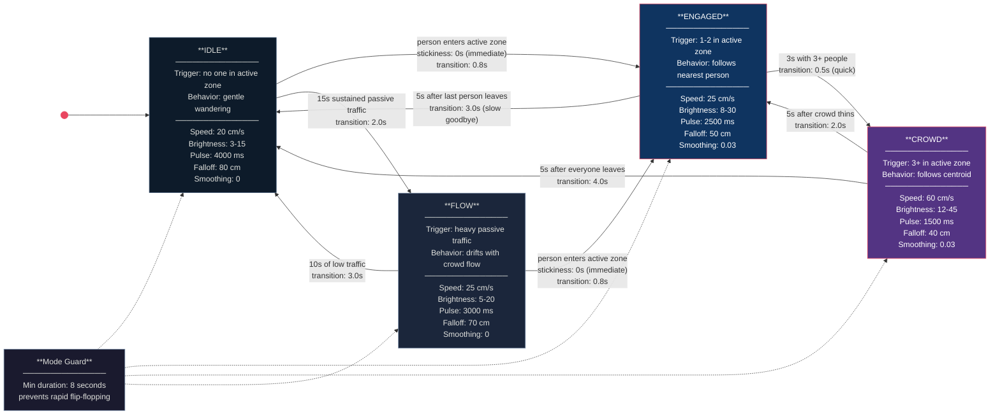

**Key design choice**: Engaging is fast (0.5–0.8s), disengaging is slow (2.0–4.0s). The light is eager to connect and reluctant to let go.

---

## 3. The 17-Layer Parameter Pipeline

This is the heart of the system. Every frame, `calculate_parameters()` in `light_behavior.py` builds the output params dict by passing it through 17 sequential layers. Each layer can modify brightness, speed, falloff, pulse rate, smoothing, and/or wander interval.

The layers are grouped into four stages: **Foundation** sets the starting point, **Personality & Context** applies the light's character and time awareness, **Environmental Response** reacts to what's happening around the light, and **Overlays** add momentary expressive effects.

```mermaid
flowchart TB
    subgraph FOUNDATION["1 - Foundation"]
        direction TB
        L1["<b>Mode Base Values</b><br/>───────────────<br/>Input: current BehaviorMode<br/>Lookup: MODE_PARAMS table<br/>Sets: all 7 output params"]
        L2["<b>Transition Interpolation</b><br/>───────────────<br/>Condition: mode is switching<br/>Method: lerp old params to new<br/>Duration: 0.5 - 4.0s per type"]
        L3["<b>People-Count Scaling</b><br/>───────────────<br/>Input: active person count<br/>Effect: +20% brightness per person<br/>Affects: brightness_min, brightness_max"]
        L1 --> L2 --> L3
    end

    subgraph PERSONALITY["2 - Personality and Context"]
        direction TB
        L4["<b>MetaParameter Modifiers</b><br/>───────────────<br/>Input: 6 personality sliders (0-1)<br/>Input: 6 global multipliers (default 1.0)<br/>Method: lerp + multiply<br/>Affects: speed, brightness, pulse, smoothing, wander"]
        L5["<b>Time-of-Day</b><br/>───────────────<br/>Input: current hour<br/>Brightness: x0.4 (night) to x1.1 (rush)<br/>Pulse: x0.7 to x1.5<br/>Wander Y: constrained by period"]
        L6["<b>Dwell Rewards</b><br/>───────────────<br/>Input: person dwell time<br/>Phases: Notice / Greet / Engage / Bond<br/>Effect: longer dwell = brighter, tighter<br/>Scale: dwell_influence multiplier"]
        L7["<b>Anti-Repetition</b><br/>───────────────<br/>Input: recent gesture + position history<br/>Scale: memory meta parameter<br/>Effect: suppresses repeated patterns"]
        L4 --> L5 --> L6 --> L7
    end

    subgraph ENVIRONMENT["3 - Environmental Response"]
        direction TB
        L8["<b>Idle Trends</b><br/>───────────────<br/>Windows: 1m / 5m / 30m / 1h<br/>Derived: anticipation (0-1)<br/>Derived: energy_level (0-1)<br/>Derived: flow_momentum (-1 to +1)"]
        L9["<b>Aggression</b><br/>───────────────<br/>Input: time without engagement<br/>Range: 0-1 (EMA smoothed)<br/>Cap: time-of-day dependent<br/>Effect: wander width, pulse, gesture rate"]
        L10["<b>Flow Positioning</b><br/>───────────────<br/>Input: flow direction + strength<br/>Effect: wander box X shifts toward<br/>incoming pedestrian traffic"]
        L11["<b>Almost-Engaged Attraction</b><br/>───────────────<br/>Input: people slowing near active zone<br/>Strategies: brightness / drift / pause<br/>A/B tested: conversion per strategy"]
        L12["<b>Feedback Learning</b><br/>───────────────<br/>Input: 50-context ring buffer<br/>Dims: position x aggression x time x flow<br/>Output: engagement correlation weights"]
        L13["<b>Proximity Response</b><br/>───────────────<br/>Input: person Z distance (78-283 cm)<br/>Near: speed x0.6, bright x1.4, smooth x0.7<br/>Far: speed x1.4, bright x0.8, smooth x1.3<br/>Method: linear interpolation"]
        L8 --> L9 --> L10 --> L11 --> L12 --> L13
    end

    subgraph OVERLAYS["4 - Momentary Overlays"]
        direction TB
        L14["<b>Flow Bias</b><br/>───────────────<br/>Input: flow_balance value<br/>Effect: shifts wander box X"]
        L15["<b>Entry Pulse</b><br/>───────────────<br/>Trigger: person enters active zone<br/>Effect: +25 brightness (one-shot)"]
        L16["<b>Breathing Overlay</b><br/>───────────────<br/>Type: multiplicative sine wave<br/>Brightness: +/-12% at full depth<br/>Radius: +/-6% at full depth<br/>Ramp: 0 to full over 8 seconds"]
        L17["<b>Settle / Bloom</b><br/>───────────────<br/>Settle: radius -15%, speed -20%, bright +8%<br/>Bloom: radius to 300cm, bright +50%<br/>Bloom chance: 15%/min, 45s cooldown"]
        L14 --> L15 --> L16 --> L17
    end

    L3 --> L4
    L7 --> L8
    L13 --> L14

    L17 --> OUT["<b>Final behavior_params dict</b><br/>───────────────<br/>brightness_min / brightness_max<br/>pulse_speed / falloff_radius<br/>move_speed / follow_smoothing<br/>wander_interval"]

    style FOUNDATION fill:#0d1b2a,stroke:#1b263b,color:#e0e1dd
    style PERSONALITY fill:#1b263b,stroke:#415a77,color:#e0e1dd
    style ENVIRONMENT fill:#415a77,stroke:#778da9,color:#e0e1dd
    style OVERLAYS fill:#778da9,stroke:#e0e1dd,color:#0d1b2a
    style OUT fill:#e94560,stroke:#fff,color:#fff
```

**What each output parameter controls:**

| Parameter | What it does |
|---|---|
| `brightness_min` / `brightness_max` | DMX brightness range for the pulse cycle |
| `pulse_speed` | Period of the brightness sine wave (ms) |
| `falloff_radius` | How far from the light panels still illuminate (cm) |
| `move_speed` | How fast the light moves toward its target (cm/s) |
| `follow_smoothing` | How tightly the light tracks a person (0 = no follow, 0.2 = tight) |
| `wander_interval` | Time between picking new wander targets (s) |

---

## 4. MetaParameters → Actual Light Values

The personality system consists of **6 sliders** (0.0–1.0) that define the light's character and **6 global multipliers** that scale the output. Together they transform the mode base values into the light's actual behavior.

`apply_meta_modifiers()` in `light_behavior.py` maps each personality slider to one or more output parameters using linear interpolation, then applies the global multipliers.

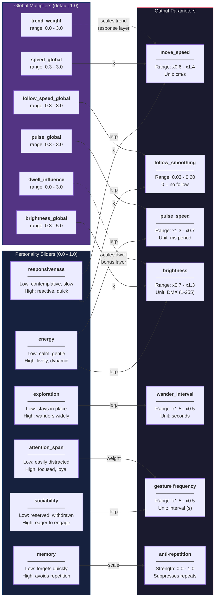

**Example**: With `responsiveness = 0.8` and `speed_global = 1.2`:
- Base mode speed is 20 cm/s (IDLE)
- Responsiveness maps to ×1.24 (lerp between 0.6 and 1.4 at 0.8)
- Global multiplier applies: 20 × 1.24 × 1.2 = **29.8 cm/s**

The sliders interact with each other through the gesture system: `sociability` controls how often gestures fire, `attention_span` influences which gestures are chosen (high attention → more SETTLE and focused gestures), and `memory` suppresses recently-used gestures.

---

## 5. AutoTuning Feedback Loop

The `AutoTuningManager` runs every 5 seconds and continuously adjusts the personality parameters based on observed activity. This creates a light that learns and adapts its character over hours and days.

The key insight is **asymmetric adjustment**: personality sliders (responsiveness, energy, sociability) are only pushed *up* when activity is high — they're never pushed down. Only mean reversion gently brings them back toward home values when things are quiet. This prevents the light from becoming permanently suppressed on a quiet sidewalk.

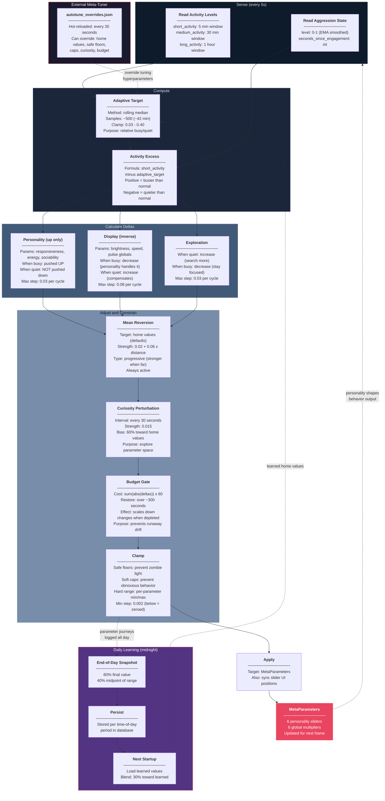

**Tuned parameters and their constraints:**

| Parameter | Min | Max | Safe Floor | Soft Cap | Home |
|---|---|---|---|---|---|
| responsiveness | 0.1 | 0.95 | 0.30 | — | 0.50 |
| energy | 0.1 | 0.95 | 0.25 | — | 0.50 |
| attention_span | 0.1 | 0.95 | — | — | 0.50 |
| sociability | 0.1 | 0.95 | 0.20 | — | 0.50 |
| exploration | 0.1 | 0.95 | — | — | 0.50 |
| memory | 0.1 | 0.95 | — | — | 0.50 |
| brightness_global | 0.3 | 5.0 | 0.50 | 3.0 | 1.00 |
| speed_global | 0.3 | 3.0 | 0.40 | 1.6 | 1.00 |
| pulse_global | 0.3 | 3.0 | — | 2.0 | 1.00 |
| follow_speed_global | 0.3 | 3.0 | — | — | 1.00 |
| dwell_influence | 0.0 | 3.0 | — | — | 1.00 |
| idle_trend_weight | 0.0 | 3.0 | — | — | 1.00 |

**Step sizes**: Personality params max ±0.03 per 5s cycle. Global multipliers max ±0.08. Changes below 0.002 are zeroed to prevent micro-drift.

---

## 6. Multi-Timescale Adaptation

The system processes information across five timescales simultaneously. Fast loops handle moment-to-moment responsiveness, while slow loops gradually shape the light's long-term character. This creates behavior that feels both reactive and intentional.

```mermaid
flowchart TB
    subgraph FRAME["Per-Frame (~33ms)"]
        F1["<b>Mode Switching</b><br/>───────────<br/>Check: active zone occupancy<br/>Apply: stickiness timers"]
        F2["<b>Gesture Triggering</b><br/>───────────<br/>Check: cooldowns, phase gates<br/>Fire: weighted random selection"]
        F3["<b>Proximity Response</b><br/>───────────<br/>Input: person Z distance<br/>Scale: speed, brightness, smoothing"]
        F4["<b>Position Interpolation</b><br/>───────────<br/>Method: exponential decay toward target<br/>Rate: move_speed cm/s"]
        F5["<b>Breathing Overlay</b><br/>───────────<br/>Advance: sine wave phase<br/>Apply: brightness +/-12%, radius +/-6%"]
        F6["<b>Panel Brightness</b><br/>───────────<br/>Calc: 12x distance falloff<br/>Output: DMX values to Art-Net"]
    end

    subgraph SECONDS["Every 1.5 - 5 seconds"]
        S1["<b>Flow Tracking</b><br/>───────────<br/>Interval: 1.5 seconds<br/>Window: 30 seconds sliding<br/>Output: direction (-1 to +1), strength (0-1)"]
        S2["<b>Auto-Tuning Cycle</b><br/>───────────<br/>Interval: 5 seconds<br/>Read: trends, aggression<br/>Write: MetaParameters (12 params)"]
        S3["<b>Attraction Strategy</b><br/>───────────<br/>Rotate: brightness / drift / pause<br/>Track: conversion per strategy<br/>Cooldown: 5 seconds"]
    end

    subgraph MINUTES["Rolling Windows (1m - 60m)"]
        M1["<b>Recent</b> (1 min)<br/>───────────<br/>Use: immediate reactivity<br/>Drives: ready-for-action posture"]
        M2["<b>Short</b> (5 min)<br/>───────────<br/>Output: short_activity weight<br/>Feeds: auto-tuning primary signal"]
        M3["<b>Medium</b> (30 min)<br/>───────────<br/>Output: medium_activity weight<br/>Use: general activity level"]
        M4["<b>Long</b> (1 hour)<br/>───────────<br/>Output: long_activity weight<br/>Use: big-picture energy level"]
        M5["<b>Aggression EMA</b><br/>───────────<br/>Rises: without engagement<br/>Capped: by time-of-day table<br/>Range: 0 - 0.8 depending on hour"]
    end

    subgraph DAILY["Daily"]
        D1["<b>Time-of-Day Modifiers</b><br/>───────────<br/>Periods: late_night / waking /<br/>active / rush / evening<br/>Scales: brightness, pulse, wander Y"]
        D2["<b>Parameter Resets</b><br/>───────────<br/>Times: midnight / 6am / noon / 6pm<br/>Method: 40% blend toward home values"]
        D3["<b>Daily Report</b><br/>───────────<br/>Time: 12:01 AM<br/>Content: engagement stats, population,<br/>parameter journey summary"]
        D4["<b>Daily Learning</b><br/>───────────<br/>Compute: optimal starting values<br/>Granularity: per time-of-day period"]
    end

    subgraph WEEKLY["Weekly"]
        W1["<b>Engagement History</b><br/>───────────<br/>Method: 7-day weighted average<br/>Granularity: by time period"]
        W2["<b>Cap Loosening</b><br/>───────────<br/>Trigger: param consistently hits ceiling<br/>Effect: nudge cap up 10% for next day"]
        W3["<b>Feedback Learning</b><br/>───────────<br/>Buffer: 50 recent engagement contexts<br/>Dims: position x aggression x time x flow<br/>Rate: +/-0.02 per engagement"]
    end

    FRAME --> SECONDS --> MINUTES --> DAILY --> WEEKLY

    style FRAME fill:#e94560,stroke:#fff,color:#fff
    style SECONDS fill:#533483,stroke:#e94560,color:#fff
    style MINUTES fill:#415a77,stroke:#778da9,color:#e0e1dd
    style DAILY fill:#1b263b,stroke:#415a77,color:#e0e1dd
    style WEEKLY fill:#0d1b2a,stroke:#1b263b,color:#e0e1dd
```

**How the timescales connect:**

- The **minute-scale** trend windows feed the **5-second** auto-tuning cycle as activity signals
- The **daily** learning cycle sets starting home values for the next day's auto-tuning
- The **weekly** engagement history informs daily learning (7-day weighted average)
- **Per-frame** rendering reads the MetaParameters that the 5-second tuner has adjusted
- **Flow tracking** (1.5s) feeds both the per-frame flow mode logic and the minute-scale trend analysis

---

## 7. Light Position → Panel DMX Output

The final stage converts the virtual point light into 12 physical DMX values. The `PanelSystem` models the exact physical layout of the installation: 4 lighting units mounted at different X positions, each containing 3 LED panels at different angles.

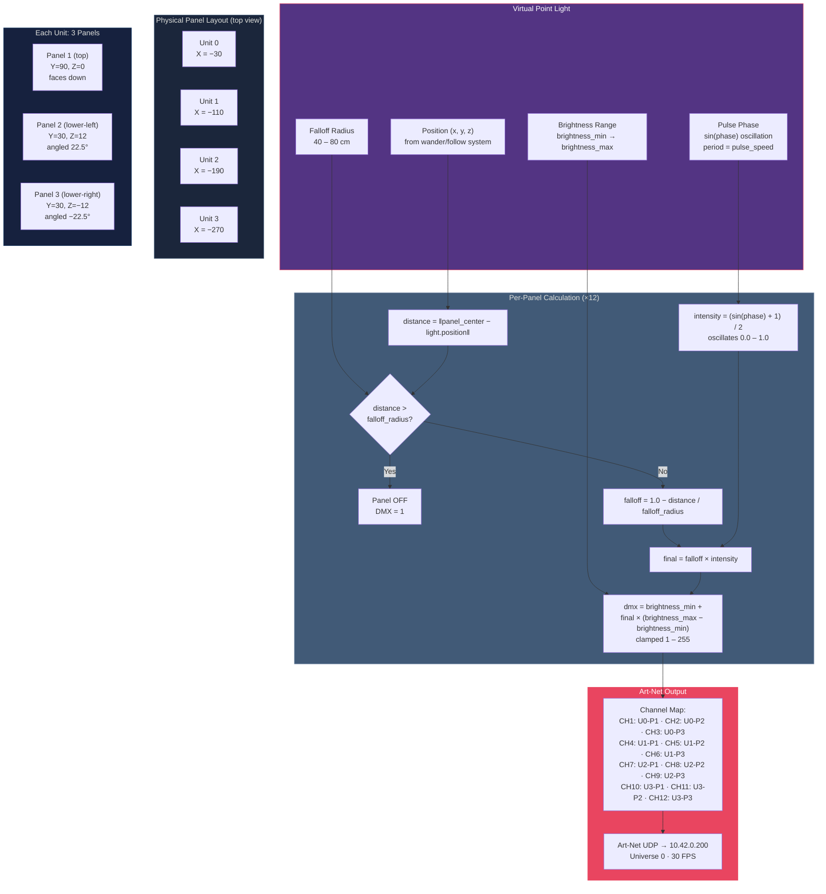

**The brightness equation in plain language:**

1. Measure the distance from the light to each panel's center point
2. If the panel is outside the falloff radius, it's off (DMX = 1)
3. Otherwise, compute a falloff factor: closer panels are brighter (linear decay)
4. Multiply the falloff by the current pulse intensity (a sine wave that breathes between 0 and 1)
5. Map the result into the brightness range and convert to a DMX byte (1–255)

The falloff radius is the single most impactful parameter on how the light "looks." A small radius (40cm in CROWD mode) creates a tight spotlight that isolates individual panels. A large radius (80cm in IDLE mode) creates a soft wash across multiple panels.

---

## Wander Box: Behavior Inputs to Spatial Motion

The wander box is a 3D bounding volume that constrains where the virtual point light can move. Rather than roaming freely, the light picks random targets inside this box and lerps toward them, creating the characteristic slow drift seen in IDLE mode and the tight tracking seen in ENGAGED mode. Every behavior modifier — flow direction, aggression, engagement contraction — works by reshaping the box, not by steering the light directly.

The box uses a three-layer animation system: `current_wander_box` reflects the raw mode and modifier state, `animated_wander_box` smooths that with an exponential lerp (speed 3.0, ~95% converged in one second), and `WanderBehavior` picks random points inside the animated box at timed intervals. This layered approach prevents jarring jumps when mode or engagement state changes.

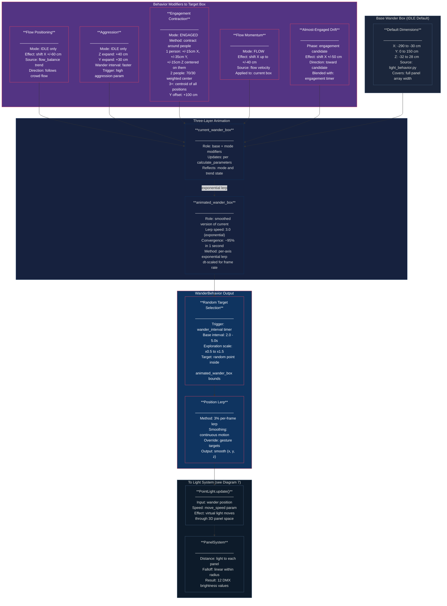

---

## 8. Engagement Lifecycle

This diagram traces a complete person interaction from arrival to departure, showing which systems activate at each stage. The dwell phases progressively deepen the connection, while the gesture system and breathing overlay add expressive texture throughout.

```mermaid
sequenceDiagram
    participant P as Person
    participant Z as Zone Classification
    participant B as Behavior System
    participant G as Gesture System
    participant L as Light Output

    Note over P,L: ── Person Approaches ──

    P->>Z: Enters passive zone
    Z->>B: passive_count += 1
    B->>G: Trigger ACKNOWLEDGE
    G->>L: Brief move toward passerby

    Note over P,L: ── Person Enters Active Zone ──

    P->>Z: Crosses into active zone
    Z->>B: active_count += 1
    B->>B: Mode: IDLE → ENGAGED (immediate)
    B->>G: Trigger WELCOME
    G->>L: Entry pulse: +25 brightness flash
    B->>L: Transition interpolation (0.8s)

    rect rgb(30, 40, 70)
        Note over B,L: NOTICE PHASE (0–3s)
        B->>L: Light turns toward person
        B->>L: Brightness ramping up
        Note right of G: No positional gestures yet
    end

    rect rgb(40, 50, 90)
        Note over B,L: GREET PHASE (3–10s)
        B->>L: Brightness increase settled
        B->>L: Breathing overlay begins ramping in (8s ramp)
        loop Every 8–15s
            G->>L: NOD (1.2s, most common)
            G->>L: LEAN (1.5s, leaning in)
            G->>L: BREATHE (4.0s, shared rhythm)
        end
    end

    rect rgb(50, 60, 110)
        Note over B,L: ENGAGE PHASE (10–30s)
        B->>L: Breathing at full depth (±12% brightness, ±6% radius)
        B->>L: Tighter tracking, brighter output
        loop Every 10–20s
            G->>L: SWAY (3.0s, lateral oscillation)
            G->>L: ORBIT (4.0s, lazy circle)
            G->>L: BREATHE (5.0s, deeper)
            G->>L: NOD / LEAN (carried forward)
        end
    end

    rect rgb(60, 70, 130)
        Note over B,L: BOND PHASE (30s+)
        B->>L: Maximum intimacy
        B->>L: Very settled, infrequent gestures
        loop Every 15–30s
            G->>L: SWAY (4.0s)
            G->>L: ORBIT (5.0s)
            G->>L: SETTLE (3.0s, tighten in closer)
            G->>L: BREATHE (6.0s)
        end
    end

    Note over P,L: ── Person Leaves ──

    P->>Z: Exits active zone
    Z->>B: active_count = 0
    B->>B: Start 5s stickiness timer

    alt Dwell was > 5s and no one remains
        B->>G: Trigger FAREWELL
        G->>L: Reluctant move toward last position
    end

    Note over B: 5s passes with no one...
    B->>B: Mode: ENGAGED → IDLE
    B->>L: Transition interpolation (3.0s slow goodbye)
    B->>L: Breathing overlay ramps out
    B->>L: Return to gentle wandering
```

**What the person experiences:**

1. Walking past, the light briefly acknowledges them — a subtle flicker of awareness
2. Stepping under the panels, the light immediately locks on with a welcoming pulse
3. Standing still, they notice the light beginning to breathe — a slow shared rhythm
4. After 10 seconds, the light starts to sway and orbit gently, as if comfortable in their presence
5. After 30 seconds, the light settles in close — maximum intimacy, minimal movement
6. Walking away, the light lingers, reluctantly following their last position before slowly fading back to its wandering state

The entire interaction is shaped by the current MetaParameters — a highly social, energetic personality will greet faster, gesture more frequently, and track more tightly. A shy, calm personality will be subtle and slow, with longer pauses between gestures.

---

## Appendix: How Everything Connects

This final diagram shows the complete system with all feedback loops visible at once — the "full picture" view of how inputs, processing layers, adaptation loops, and outputs relate to each other.

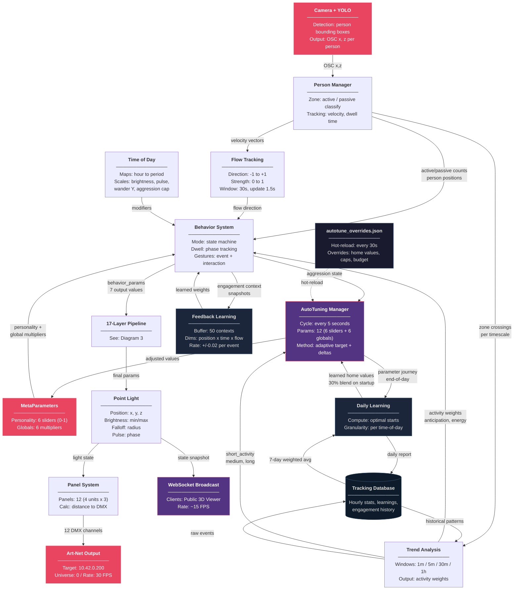

---

# Part 2: Camera Tracking System

The following diagrams explain how two RTSP cameras capture video, detect people
using YOLO, project detections to real-world floor coordinates via calibration,
fuse cross-camera observations, and output tracked positions over OSC. This is
the upstream data source that feeds the behavior system described in Part 1.

---

## Diagram 9 — Camera System Overview

High-level pipeline from physical cameras to the OSC messages consumed by the light controller. Two Reolink PoE cameras feed RTSP streams into threaded capture buffers, YOLO detects people, calibration projects pixel positions onto the floor plane, and cross-camera fusion produces stable world-coordinate tracks. The final OSC messages carry person count and per-person (id, x, z) positions to `lightController_osc.py` at roughly 25 updates per second.

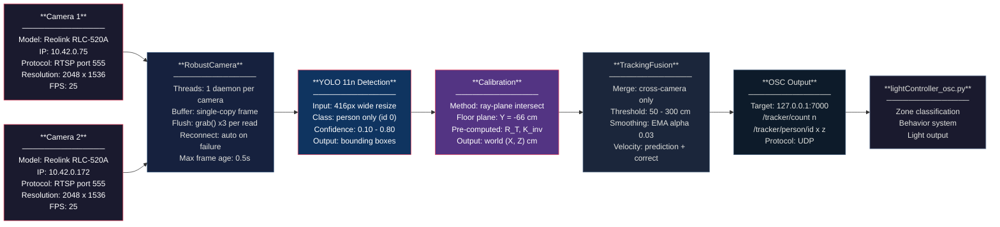

---

## Diagram 10 — Physical Setup and Coordinate System

Camera positions, ArUco calibration markers, and tracking zones placed in the real-world coordinate system. The origin sits at the back-right corner of Panel Unit 0 at floor level, with X running negative toward Unit 3, Y pointing up, and Z extending outward into the sidewalk. Seven ArUco markers at known 3D positions provide the calibration reference, and two depth zones (active and passive) define the engagement boundaries used by the behavior system.

```mermaid
flowchart TB
    subgraph COORD ["Coordinate System"]
        ORIGIN["**Origin**
        ───────────────
        Location: back-right corner
        of Panel Unit 0, floor level
        X: negative toward Unit 3
        Y: positive upward
        Z: positive into tracking zone"]
    end

    subgraph LEVELS ["Reference Levels"]
        FLOOR["**Storefront Floor**
        ───────────────
        Y: 0 cm
        Role: reference plane"]

        LEDGE["**Camera Ledge**
        ───────────────
        Y: -15 cm
        Height: 51 cm above street"]

        STREET["**Street Level**
        ───────────────
        Y: -66 cm
        Role: pedestrian floor plane
        Used by: calibration intersect"]
    end

    subgraph CAMERAS ["Camera Positions"]
        C1["**Camera 1 (Right)**
        ───────────────
        Position: X=-30, Y=-15, Z=78
        IP: 10.42.0.75
        Aligned with: Unit 0 center
        FOV: 80 deg horiz, 48 deg vert
        Pitch: 22 deg down
        Yaw: ~25 deg left"]

        C2["**Camera 2 (Left)**
        ───────────────
        Position: X=-270, Y=-15, Z=78
        IP: 10.42.0.172
        Aligned with: Unit 3 center
        FOV: 80 deg horiz, 48 deg vert
        Pitch: 22 deg down
        Yaw: ~25 deg right"]
    end

    subgraph PANELS ["Panel Units (60 cm wide, 80 cm spacing)"]
        P0["**Unit 0**
        ───────────────
        Center X: -30
        Edges: 0 to -60"]

        P1["**Unit 1**
        ───────────────
        Center X: -110
        Edges: -80 to -140"]

        P2["**Unit 2**
        ───────────────
        Center X: -190
        Edges: -160 to -220"]

        P3["**Unit 3**
        ───────────────
        Center X: -270
        Edges: -240 to -300"]
    end

    subgraph ZONES ["Tracking Zones"]
        ACTIVE["**Active Zone**
        ───────────────
        X: -350 to 50
        Z: 78 to 283
        Depth: ~2 m from panels
        Role: engaged interaction"]

        PASSIVE["**Passive Zone**
        ───────────────
        X: -350 to 50
        Z: 283 to 553
        Depth: ~2.7 m beyond active
        Role: sidewalk passersby"]
    end

    COORD --> LEVELS
    COORD --> CAMERAS
    CAMERAS --> PANELS
    PANELS --> ZONES

    style COORD fill:#0d1b2a,stroke:#778da9,color:#e0e1dd
    style LEVELS fill:#1a1a2e,stroke:#778da9,color:#e0e1dd
    style CAMERAS fill:#16213e,stroke:#e94560,color:#fff
    style PANELS fill:#1b263b,stroke:#415a77,color:#e0e1dd
    style ZONES fill:#0f3460,stroke:#e94560,color:#fff
    style ORIGIN fill:#0d1b2a,stroke:#415a77,color:#e0e1dd
    style FLOOR fill:#1a1a2e,stroke:#778da9,color:#e0e1dd
    style LEDGE fill:#1a1a2e,stroke:#778da9,color:#e0e1dd
    style STREET fill:#1a1a2e,stroke:#778da9,color:#e0e1dd
    style C1 fill:#16213e,stroke:#e94560,color:#fff
    style C2 fill:#16213e,stroke:#e94560,color:#fff
    style P0 fill:#1b263b,stroke:#415a77,color:#e0e1dd
    style P1 fill:#1b263b,stroke:#415a77,color:#e0e1dd
    style P2 fill:#1b263b,stroke:#415a77,color:#e0e1dd
    style P3 fill:#1b263b,stroke:#415a77,color:#e0e1dd
    style ACTIVE fill:#0f3460,stroke:#e94560,color:#fff
    style PASSIVE fill:#0f3460,stroke:#e94560,color:#fff
```

---

## Diagram 11 — Camera Capture and YOLO Detection

Each camera runs a dedicated daemon thread that continuously reads RTSP frames and stores the most recent one under a lock. The main tracking loop retrieves these frames, resizes them to 416 pixels wide for speed, and passes them through YOLO 11n to detect people. Detected bounding boxes are scaled back to full resolution and cached per camera so that unchanged frames reuse the previous detection without re-running inference.

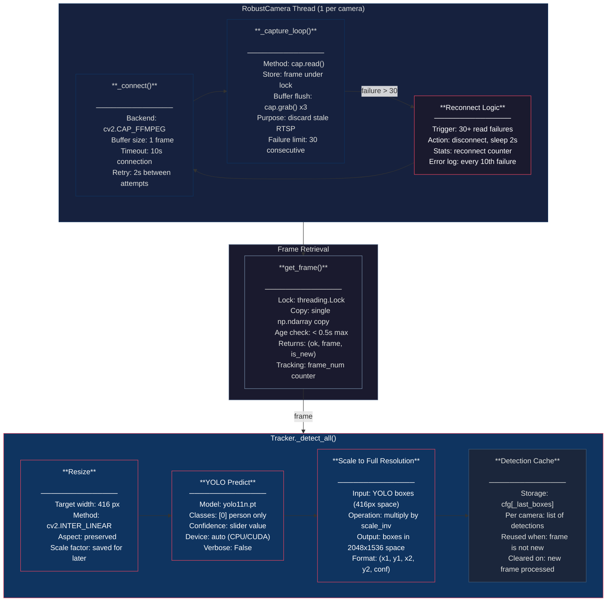

---

## Diagram 12 — Calibration: Pixel to World Coordinates

The ray-plane intersection math that transforms a bounding-box foot position in image pixels to a real-world floor position in centimeters. For each detection, the bottom-center of the bounding box is treated as the person's feet; that pixel is undistorted, projected into a camera-space ray using the inverse intrinsic matrix, rotated into world space, and intersected with the known floor plane at Y = -66 cm. The result is a (world_x, world_z) pair in centimeters that feeds directly into the fusion stage.

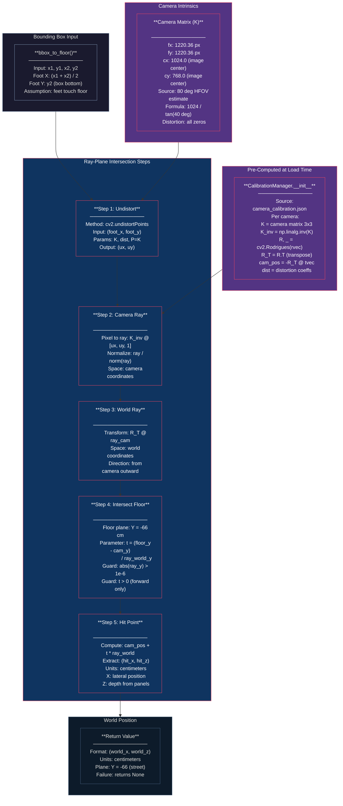

---

## Diagram 13 — Cross-Camera Fusion and Temporal Tracking

Detections from the two cameras are fused spatially and then matched temporally to produce stable, smoothed tracks. Spatial fusion uses greedy nearest-neighbor matching across cameras only (same-camera detections are never merged) with a configurable distance threshold. Temporal tracking predicts each existing track's next position using its velocity, matches incoming detections to predictions, applies exponential moving average smoothing, and prunes tracks unseen for more than 60 frames.

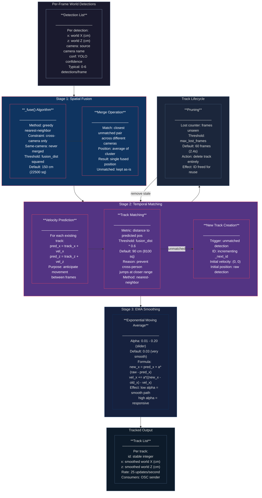

---

## Diagram 14 — ArUco Calibration Process

The one-time camera calibration uses seven ArUco markers placed at known 3D positions to compute each camera's rotation and translation via `cv2.solvePnP`. Each marker provides four corner correspondences between known world coordinates and detected image pixels, giving enough constraints for a robust pose estimate. The solver tries multiple corner orderings and validates results against reprojection error, camera position sanity, and expected location drift before saving the best solution to `camera_calibration.json`.

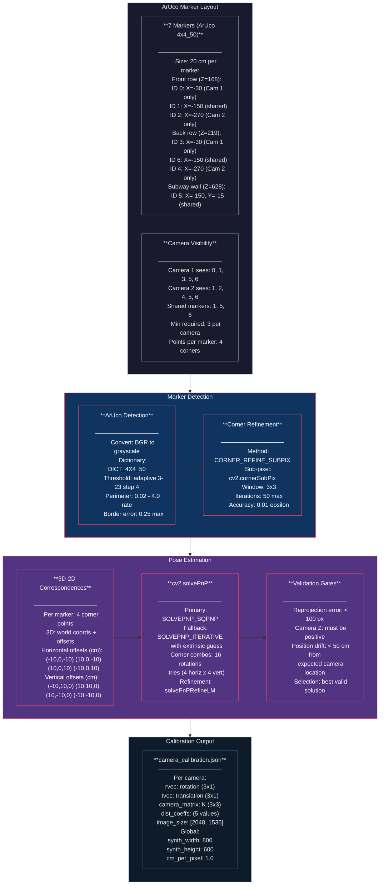

---

## Diagram 15 — Main Loop and Tunable Parameters

The tracker's main loop runs at a fixed 25 FPS, cycling through detection, fusion, OSC output, and optional visualization on every frame. Three live slider parameters — confidence threshold, fusion distance, and EMA smoothing alpha — let the operator tune the tradeoff between responsiveness and stability without restarting. Periodic background tasks auto-save settings every 5 seconds, log health metrics every 5 minutes, and reload the YOLO model hourly to prevent tracker drift.

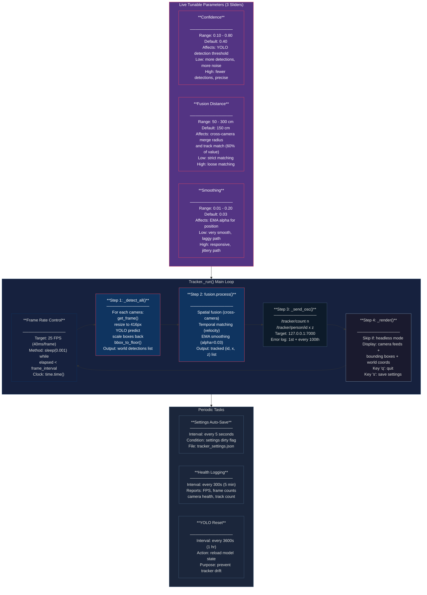

---

## Diagram 16 — End-to-End Data Transform

A sequential walkthrough showing the exact data shape at each stage of the pipeline, from a 2048x1536 H.264 frame to the final OSC messages consumed by the behavior system. Each handoff is annotated with the concrete values and formats involved — pixel coordinates, scale factors, ray equations, fusion thresholds, and EMA parameters. This diagram serves as a debugging reference: if tracking behaves unexpectedly, you can trace the data transforms step by step to isolate where the problem occurs.

```mermaid
sequenceDiagram
    participant RTSP as RTSP Stream
    participant RC as RobustCamera
    participant YOLO as YOLO 11n
    participant CAL as Calibration
    participant FUS as Fusion
    participant TRK as Tracking
    participant OSC as OSC Output
    participant LC as lightController

    Note over RTSP: 2048 x 1536 H.264 frame

    RTSP->>RC: raw frame (BGR numpy array)
    Note over RC: Thread buffer, grab() flush x3

    RC->>YOLO: resized frame (416 x 312 px)
    Note over YOLO: model.predict(conf=0.40, classes=[0])

    YOLO->>YOLO: bbox in 416px space (x1, y1, x2, y2, conf)
    YOLO->>CAL: bbox in 2048px space (scaled by 4.93x)

    Note over CAL: foot = ((x1+x2)/2, y2)

    rect rgb(83, 52, 131)
        Note over CAL: Ray-Plane Intersection
        CAL->>CAL: undistort (ux, uy)
        CAL->>CAL: ray_cam = K_inv @ [ux, uy, 1]
        CAL->>CAL: ray_world = R_T @ ray_cam
        CAL->>CAL: t = (-66 - cam_y) / ray_y
        CAL->>CAL: hit = cam_pos + t * ray_world
    end

    CAL->>FUS: world detection (x_cm, z_cm, camera, conf)

    Note over FUS: Merge detections from<br/>different cameras within 150cm

    rect rgb(15, 52, 96)
        Note over FUS: Cross-Camera Fusion
        FUS->>FUS: greedy nearest-neighbor
        FUS->>FUS: average merged positions
    end

    FUS->>TRK: fused positions [(x, z), ...]

    rect rgb(22, 33, 62)
        Note over TRK: Temporal Tracking
        TRK->>TRK: predict: pos + velocity
        TRK->>TRK: match within 90cm (60% of 150)
        TRK->>TRK: EMA smooth (alpha=0.03)
        TRK->>TRK: update velocity
        TRK->>TRK: prune lost > 60 frames
    end

    TRK->>OSC: tracked [(id, x_cm, z_cm), ...]

    OSC->>LC: /tracker/count 3
    OSC->>LC: /tracker/person/1 -120.5 195.3
    OSC->>LC: /tracker/person/2 -45.8 310.7
    OSC->>LC: /tracker/person/3 -250.1 155.2

    Note over LC: Zone classification<br/>Behavior system<br/>Light output
```

---

## Cross-References

| Resource | Description |
|---|---|
| [BEHAVIOR_SYSTEM.md](BEHAVIOR_SYSTEM.md) | Full prose reference for all behavior systems |
| [light_behavior.py](light_behavior.py) | State machine, gestures, trend analysis, feedback learning |
| [lightController_osc.py](lightController_osc.py) | Main loop, OSC, Art-Net, WebSocket, AutoTuning |
| [public-viewer/](public-viewer/) | Three.js web viewer (connects via WebSocket) |
| [V2_5Dev/camera_tracker_osc.py](V2_5Dev/camera_tracker_osc.py) | Camera tracker V2.5 (RTSP, YOLO, calibration, fusion, OSC) |
| [camera_calibration.py](camera_calibration.py) | Camera calibration tool (ArUco, solvePnP, synth view) |
| [camera_calibration.json](../calibration/camera_calibration.json) | Calibration data (rvec, tvec, K, distortion per camera) |
| [world_coordinates.json](world_coordinates.json) | ArUco marker 3D positions and camera intrinsics |

---

*These diagrams describe the behavior and camera tracking systems as of the current codebase. The auto-tuning, feedback learning, and daily learning mechanisms mean the light's personality evolves over time — these diagrams capture the architecture, but the actual parameter values will drift as the system adapts to its environment.*
