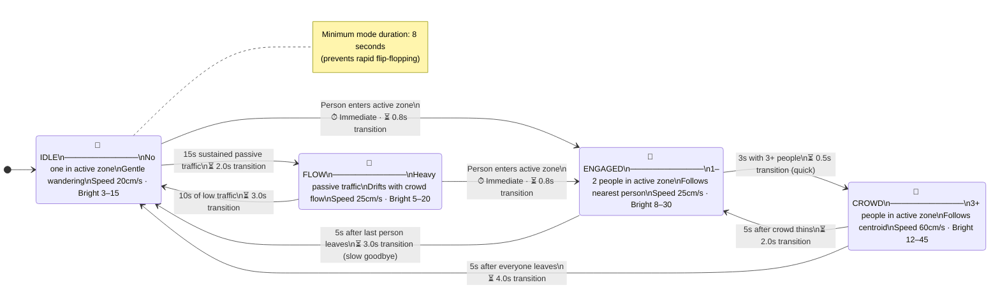
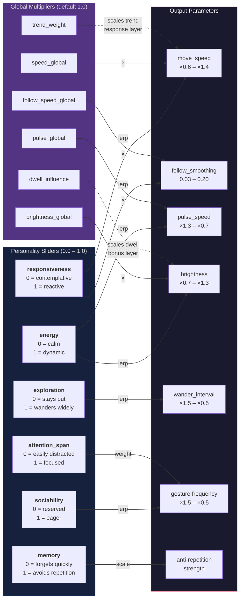
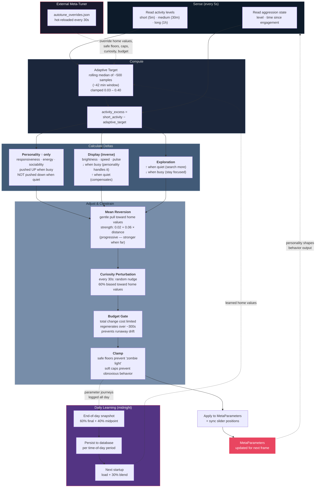
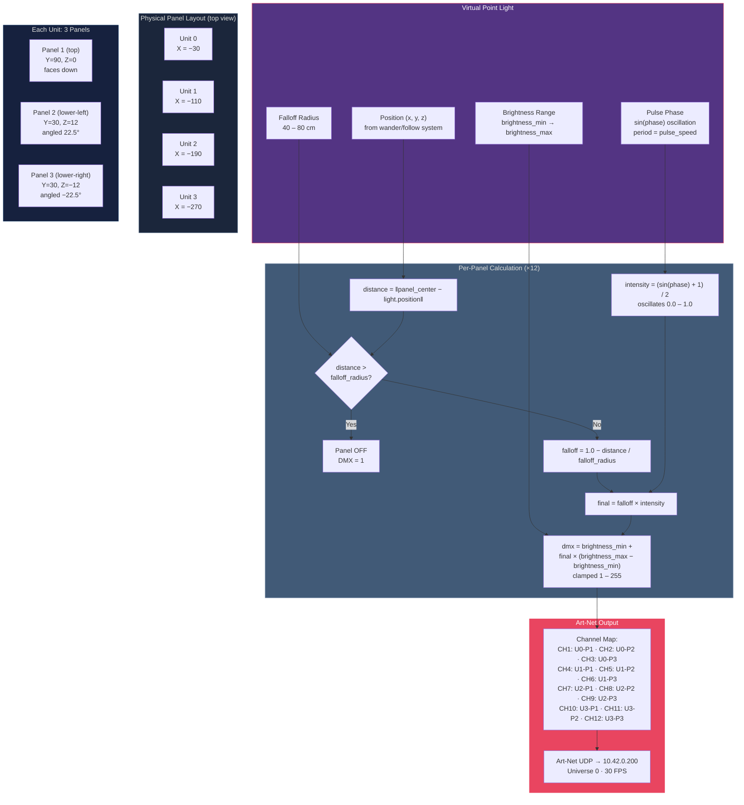
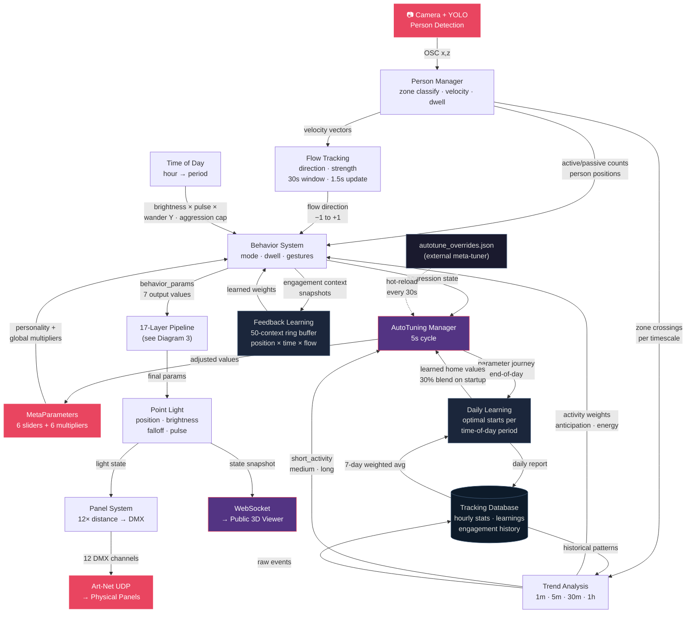

# Drop Ceiling — Behavior System Diagrams

A visual walkthrough of how the Drop Ceiling light thinks, moves, and learns — from camera input to physical light output.

Each diagram builds on the previous one, starting with the highest-level overview and drilling progressively deeper into the system's internals. If you're new to the project, read them in order.

> All diagrams use [Mermaid](https://mermaid.js.org/) syntax and render natively on GitHub.

---

## 1. System Overview

The Drop Ceiling installation is a single simulated point light that moves above a grid of LED panels. A camera watches pedestrians below, and the light responds in real-time.

At the highest level, data flows through five stages: the camera sees people, their positions arrive as OSC messages, the behavior system decides what the light should do, the controller computes per-panel brightness, and Art-Net sends DMX values to the physical panels.

```mermaid
flowchart LR
    subgraph INPUT["🎥 Input"]
        CAM["Overhead Camera<br/><i>YOLO person detection</i>"]
    end

    subgraph TRANSPORT["📡 Transport"]
        OSC["OSC Messages<br/><i>/tracker/person/&lt;id&gt; x, z</i>"]
    end

    subgraph BRAIN["🧠 Behavior Engine"]
        direction TB
        TRACK["Person Manager<br/><i>zone classification,<br/>velocity, dwell time</i>"]
        BEH["Behavior System<br/><i>mode, gestures,<br/>personality, learning</i>"]
        TRACK --> BEH
    end

    subgraph CONTROLLER["⚡ Light Controller"]
        direction TB
        LIGHT["Point Light<br/><i>position, brightness,<br/>falloff, pulse</i>"]
        PANELS["Panel System<br/><i>12 panels: distance → DMX</i>"]
        LIGHT --> PANELS
    end

    subgraph OUTPUT["💡 Physical Output"]
        ARTNET["Art-Net UDP<br/><i>12 DMX channels</i>"]
        LEDS["LED Panels<br/><i>4 units × 3 panels</i>"]
        ARTNET --> LEDS
    end

    CAM -->|"UDP"| OSC
    OSC -->|"x, z coordinates<br/>per person"| TRACK
    BEH -->|"behavior_params dict<br/>brightness, speed, falloff,<br/>pulse, smoothing, wander"| LIGHT
    PANELS -->|"DMX values<br/>1–255 per panel"| ARTNET

    style INPUT fill:#1a1a2e,stroke:#e94560,color:#fff
    style TRANSPORT fill:#1a1a2e,stroke:#0f3460,color:#fff
    style BRAIN fill:#1a1a2e,stroke:#16213e,color:#fff
    style CONTROLLER fill:#1a1a2e,stroke:#533483,color:#fff
    style OUTPUT fill:#1a1a2e,stroke:#e94560,color:#fff
```

Two Python files implement the entire system:

| File | Responsibility |
|---|---|
| `light_behavior.py` | State machine, gestures, trend analysis, feedback learning |
| `lightController_osc.py` | Main loop, OSC input, point light, panel math, Art-Net output, auto-tuning |

The behavior system outputs a **params dict** every frame containing target values for brightness, speed, falloff radius, pulse rate, follow smoothing, and wander interval. The controller interpolates toward these targets and computes per-panel DMX values.

---

## 2. Behavior Mode State Machine

The light is always in one of four modes. Mode determines the base personality — how fast it moves, how bright it shines, and whether it follows someone or wanders on its own.

Transitions are **not instantaneous**. Conditions must persist for a minimum duration (stickiness) before the mode switches, and parameters interpolate smoothly over a transition period. This prevents erratic flickering between states.

**Key design choice**: Engaging is fast (0.5–0.8s), disengaging is slow (2.0–4.0s). The light is eager to connect and reluctant to let go.

---

## 3. The 17-Layer Parameter Pipeline

This is the heart of the system. Every frame, `calculate_parameters()` in `light_behavior.py` builds the output params dict by passing it through 17 sequential layers. Each layer can modify brightness, speed, falloff, pulse rate, smoothing, and/or wander interval.

The layers are grouped into four stages: **Foundation** sets the starting point, **Personality & Context** applies the light's character and time awareness, **Environmental Response** reacts to what's happening around the light, and **Overlays** add momentary expressive effects.

```mermaid
flowchart TB
    subgraph FOUNDATION["① Foundation"]
        direction TB
        L1["<b>Mode Base Values</b><br/>IDLE / ENGAGED / CROWD / FLOW<br/>sets all 7 params to starting values"]
        L2["<b>Transition Interpolation</b><br/>if switching modes: lerp old → new<br/>over 0.5–4.0s"]
        L3["<b>People-Count Scaling</b><br/>+20% brightness per additional person"]
        L1 --> L2 --> L3
    end

    subgraph PERSONALITY["② Personality & Context"]
        direction TB
        L4["<b>MetaParameter Modifiers</b><br/>6 personality sliders × 6 global multipliers<br/>scale speed, brightness, pulse, smoothing, wander"]
        L5["<b>Time-of-Day</b><br/>hour → brightness ×0.4–1.1<br/>pulse ×0.7–1.5 · wander Y range"]
        L6["<b>Dwell Rewards</b><br/>longer dwell → brighter, tighter tracking<br/>4 phases: Notice → Greet → Engage → Bond"]
        L7["<b>Anti-Repetition</b><br/>memory param reduces repeated<br/>gesture patterns and positions"]
        L4 --> L5 --> L6 --> L7
    end

    subgraph ENVIRONMENT["③ Environmental Response"]
        direction TB
        L8["<b>Idle Trends</b><br/>1m/5m/30m/1h activity windows<br/>→ anticipation, energy, flow momentum"]
        L9["<b>Aggression</b><br/>0–1 attention-seeking level<br/>wider wander · brighter pulses · more gestures"]
        L10["<b>Flow Positioning</b><br/>wander box shifts toward<br/>incoming pedestrian traffic"]
        L11["<b>Almost-Engaged Attraction</b><br/>brightness pulse / drift / pause<br/>toward people slowing near active zone"]
        L12["<b>Feedback Learning</b><br/>learned weights: position × aggression ×<br/>time × flow alignment → engagement success"]
        L13["<b>Proximity Response</b><br/>closer person → slower, brighter, tighter<br/>farther → faster, dimmer, looser"]
        L8 --> L9 --> L10 --> L11 --> L12 --> L13
    end

    subgraph OVERLAYS["④ Momentary Overlays"]
        direction TB
        L14["<b>Flow Bias</b><br/>flow_balance shifts wander box X"]
        L15["<b>Entry Pulse</b><br/>+25 brightness flash<br/>when person enters active zone"]
        L16["<b>Breathing Overlay</b><br/>±12% brightness · ±6% radius<br/>sinusoidal 'shared rhythm'"]
        L17["<b>Settle / Bloom</b><br/>Settle: −15% radius, +8% brightness<br/>Bloom: radius→300cm, +50% brightness"]
        L14 --> L15 --> L16 --> L17
    end

    L3 --> L4
    L7 --> L8
    L13 --> L14

    L17 --> OUT["<b>Final behavior_params dict</b><br/>brightness_min · brightness_max<br/>pulse_speed · falloff_radius<br/>move_speed · follow_smoothing<br/>wander_interval"]

    style FOUNDATION fill:#0d1b2a,stroke:#1b263b,color:#e0e1dd
    style PERSONALITY fill:#1b263b,stroke:#415a77,color:#e0e1dd
    style ENVIRONMENT fill:#415a77,stroke:#778da9,color:#e0e1dd
    style OVERLAYS fill:#778da9,stroke:#e0e1dd,color:#0d1b2a
    style OUT fill:#e94560,stroke:#fff,color:#fff
```

**What each output parameter controls:**

| Parameter | What it does |
|---|---|
| `brightness_min` / `brightness_max` | DMX brightness range for the pulse cycle |
| `pulse_speed` | Period of the brightness sine wave (ms) |
| `falloff_radius` | How far from the light panels still illuminate (cm) |
| `move_speed` | How fast the light moves toward its target (cm/s) |
| `follow_smoothing` | How tightly the light tracks a person (0 = no follow, 0.2 = tight) |
| `wander_interval` | Time between picking new wander targets (s) |

---

## 4. MetaParameters → Actual Light Values

The personality system consists of **6 sliders** (0.0–1.0) that define the light's character and **6 global multipliers** that scale the output. Together they transform the mode base values into the light's actual behavior.

`apply_meta_modifiers()` in `light_behavior.py` maps each personality slider to one or more output parameters using linear interpolation, then applies the global multipliers.

**Example**: With `responsiveness = 0.8` and `speed_global = 1.2`:
- Base mode speed is 20 cm/s (IDLE)
- Responsiveness maps to ×1.24 (lerp between 0.6 and 1.4 at 0.8)
- Global multiplier applies: 20 × 1.24 × 1.2 = **29.8 cm/s**

The sliders interact with each other through the gesture system: `sociability` controls how often gestures fire, `attention_span` influences which gestures are chosen (high attention → more SETTLE and focused gestures), and `memory` suppresses recently-used gestures.

---

## 5. AutoTuning Feedback Loop

The `AutoTuningManager` runs every 5 seconds and continuously adjusts the personality parameters based on observed activity. This creates a light that learns and adapts its character over hours and days.

The key insight is **asymmetric adjustment**: personality sliders (responsiveness, energy, sociability) are only pushed *up* when activity is high — they're never pushed down. Only mean reversion gently brings them back toward home values when things are quiet. This prevents the light from becoming permanently suppressed on a quiet sidewalk.

**Tuned parameters and their constraints:**

| Parameter | Min | Max | Safe Floor | Soft Cap | Home |
|---|---|---|---|---|---|
| responsiveness | 0.1 | 0.95 | 0.30 | — | 0.50 |
| energy | 0.1 | 0.95 | 0.25 | — | 0.50 |
| attention_span | 0.1 | 0.95 | — | — | 0.50 |
| sociability | 0.1 | 0.95 | 0.20 | — | 0.50 |
| exploration | 0.1 | 0.95 | — | — | 0.50 |
| memory | 0.1 | 0.95 | — | — | 0.50 |
| brightness_global | 0.3 | 5.0 | 0.50 | 3.0 | 1.00 |
| speed_global | 0.3 | 3.0 | 0.40 | 1.6 | 1.00 |
| pulse_global | 0.3 | 3.0 | — | 2.0 | 1.00 |
| follow_speed_global | 0.3 | 3.0 | — | — | 1.00 |
| dwell_influence | 0.0 | 3.0 | — | — | 1.00 |
| idle_trend_weight | 0.0 | 3.0 | — | — | 1.00 |

**Step sizes**: Personality params max ±0.03 per 5s cycle. Global multipliers max ±0.08. Changes below 0.002 are zeroed to prevent micro-drift.

---

## 6. Multi-Timescale Adaptation

The system processes information across five timescales simultaneously. Fast loops handle moment-to-moment responsiveness, while slow loops gradually shape the light's long-term character. This creates behavior that feels both reactive and intentional.

```mermaid
flowchart TB
    subgraph FRAME["⚡ Per-Frame (~33ms)"]
        F1["Mode switching<br/>(is someone in the active zone?)"]
        F2["Gesture triggering<br/>(cooldown checks, phase gates)"]
        F3["Proximity response<br/>(Z-distance scaling)"]
        F4["Light position interpolation<br/>(move toward target)"]
        F5["Breathing overlay<br/>(sine wave phase advance)"]
        F6["Panel brightness calculation<br/>(distance falloff per panel)"]
    end

    subgraph SECONDS["🔄 Every 1.5 – 5 seconds"]
        S1["Flow tracking update (1.5s)<br/>30s sliding window<br/>left-vs-right traffic direction"]
        S2["Auto-tuning cycle (5s)<br/>read trends → compute deltas<br/>→ adjust MetaParameters"]
        S3["Attraction strategy rotation<br/>A/B test for almost-engaged"]
    end

    subgraph MINUTES["📊 Rolling Windows (1m – 60m)"]
        M1["<b>Recent</b> (1 min)<br/>immediate reactivity"]
        M2["<b>Short</b> (5 min)<br/>→ short_activity weight"]
        M3["<b>Medium</b> (30 min)<br/>→ medium_activity weight"]
        M4["<b>Long</b> (1 hour)<br/>→ long_activity weight"]
        M5["Aggression EMA<br/>rises without engagement<br/>capped by time-of-day"]
    end

    subgraph DAILY["📅 Daily"]
        D1["Time-of-day modifiers<br/>brightness, pulse, wander Y<br/>by period (5 periods)"]
        D2["6-hour parameter resets<br/>(midnight/6am/noon/6pm)<br/>40% blend toward home"]
        D3["Daily report at 12:01 AM<br/>engagement stats, population,<br/>parameter journey summary"]
        D4["Daily learning<br/>compute optimal starts<br/>per time-of-day period"]
    end

    subgraph WEEKLY["📆 Weekly"]
        W1["7-day weighted average<br/>of engagement metrics<br/>by time period"]
        W2["Learned cap loosening<br/>if parameter consistently<br/>hits ceiling → nudge up 10%"]
        W3["Feedback learning weights<br/>50-context ring buffer<br/>position × aggression × time<br/>→ engagement correlation"]
    end

    FRAME --> SECONDS --> MINUTES --> DAILY --> WEEKLY

    style FRAME fill:#e94560,stroke:#fff,color:#fff
    style SECONDS fill:#533483,stroke:#e94560,color:#fff
    style MINUTES fill:#415a77,stroke:#778da9,color:#e0e1dd
    style DAILY fill:#1b263b,stroke:#415a77,color:#e0e1dd
    style WEEKLY fill:#0d1b2a,stroke:#1b263b,color:#e0e1dd
```

**How the timescales connect:**

- The **minute-scale** trend windows feed the **5-second** auto-tuning cycle as activity signals
- The **daily** learning cycle sets starting home values for the next day's auto-tuning
- The **weekly** engagement history informs daily learning (7-day weighted average)
- **Per-frame** rendering reads the MetaParameters that the 5-second tuner has adjusted
- **Flow tracking** (1.5s) feeds both the per-frame flow mode logic and the minute-scale trend analysis

---

## 7. Light Position → Panel DMX Output

The final stage converts the virtual point light into 12 physical DMX values. The `PanelSystem` models the exact physical layout of the installation: 4 lighting units mounted at different X positions, each containing 3 LED panels at different angles.

**The brightness equation in plain language:**

1. Measure the distance from the light to each panel's center point
2. If the panel is outside the falloff radius, it's off (DMX = 1)
3. Otherwise, compute a falloff factor: closer panels are brighter (linear decay)
4. Multiply the falloff by the current pulse intensity (a sine wave that breathes between 0 and 1)
5. Map the result into the brightness range and convert to a DMX byte (1–255)

The falloff radius is the single most impactful parameter on how the light "looks." A small radius (40cm in CROWD mode) creates a tight spotlight that isolates individual panels. A large radius (80cm in IDLE mode) creates a soft wash across multiple panels.

---

## 8. Engagement Lifecycle

This diagram traces a complete person interaction from arrival to departure, showing which systems activate at each stage. The dwell phases progressively deepen the connection, while the gesture system and breathing overlay add expressive texture throughout.

```mermaid
sequenceDiagram
    participant P as Person
    participant Z as Zone Classification
    participant B as Behavior System
    participant G as Gesture System
    participant L as Light Output

    Note over P,L: ── Person Approaches ──

    P->>Z: Enters passive zone
    Z->>B: passive_count += 1
    B->>G: Trigger ACKNOWLEDGE
    G->>L: Brief move toward passerby

    Note over P,L: ── Person Enters Active Zone ──

    P->>Z: Crosses into active zone
    Z->>B: active_count += 1
    B->>B: Mode: IDLE → ENGAGED (immediate)
    B->>G: Trigger WELCOME
    G->>L: Entry pulse: +25 brightness flash
    B->>L: Transition interpolation (0.8s)

    rect rgb(30, 40, 70)
        Note over B,L: NOTICE PHASE (0–3s)
        B->>L: Light turns toward person
        B->>L: Brightness ramping up
        Note right of G: No positional gestures yet
    end

    rect rgb(40, 50, 90)
        Note over B,L: GREET PHASE (3–10s)
        B->>L: Brightness increase settled
        B->>L: Breathing overlay begins ramping in (8s ramp)
        loop Every 8–15s
            G->>L: NOD (1.2s, most common)
            G->>L: LEAN (1.5s, leaning in)
            G->>L: BREATHE (4.0s, shared rhythm)
        end
    end

    rect rgb(50, 60, 110)
        Note over B,L: ENGAGE PHASE (10–30s)
        B->>L: Breathing at full depth (±12% brightness, ±6% radius)
        B->>L: Tighter tracking, brighter output
        loop Every 10–20s
            G->>L: SWAY (3.0s, lateral oscillation)
            G->>L: ORBIT (4.0s, lazy circle)
            G->>L: BREATHE (5.0s, deeper)
            G->>L: NOD / LEAN (carried forward)
        end
    end

    rect rgb(60, 70, 130)
        Note over B,L: BOND PHASE (30s+)
        B->>L: Maximum intimacy
        B->>L: Very settled, infrequent gestures
        loop Every 15–30s
            G->>L: SWAY (4.0s)
            G->>L: ORBIT (5.0s)
            G->>L: SETTLE (3.0s, tighten in closer)
            G->>L: BREATHE (6.0s)
        end
    end

    Note over P,L: ── Person Leaves ──

    P->>Z: Exits active zone
    Z->>B: active_count = 0
    B->>B: Start 5s stickiness timer

    alt Dwell was > 5s and no one remains
        B->>G: Trigger FAREWELL
        G->>L: Reluctant move toward last position
    end

    Note over B: 5s passes with no one...
    B->>B: Mode: ENGAGED → IDLE
    B->>L: Transition interpolation (3.0s slow goodbye)
    B->>L: Breathing overlay ramps out
    B->>L: Return to gentle wandering
```

**What the person experiences:**

1. Walking past, the light briefly acknowledges them — a subtle flicker of awareness
2. Stepping under the panels, the light immediately locks on with a welcoming pulse
3. Standing still, they notice the light beginning to breathe — a slow shared rhythm
4. After 10 seconds, the light starts to sway and orbit gently, as if comfortable in their presence
5. After 30 seconds, the light settles in close — maximum intimacy, minimal movement
6. Walking away, the light lingers, reluctantly following their last position before slowly fading back to its wandering state

The entire interaction is shaped by the current MetaParameters — a highly social, energetic personality will greet faster, gesture more frequently, and track more tightly. A shy, calm personality will be subtle and slow, with longer pauses between gestures.

---

## Appendix: How Everything Connects

This final diagram shows the complete system with all feedback loops visible at once — the "full picture" view of how inputs, processing layers, adaptation loops, and outputs relate to each other.

---

## Cross-References

| Resource | Description |
|---|---|
| [BEHAVIOR_SYSTEM.md](BEHAVIOR_SYSTEM.md) | Full prose reference for all systems described here |
| [light_behavior.py](light_behavior.py) | State machine, gestures, trend analysis, feedback learning |
| [lightController_osc.py](lightController_osc.py) | Main loop, OSC, Art-Net, WebSocket, AutoTuning |
| [public-viewer/](public-viewer/) | Three.js web viewer (connects via WebSocket) |

---

*These diagrams describe the behavior system as of the current codebase. The auto-tuning, feedback learning, and daily learning mechanisms mean the light's personality evolves over time — these diagrams capture the architecture, but the actual parameter values will drift as the system adapts to its environment.*
