# Drop Ceiling — Camera to DMX Diagrams (Runtime-Focused)

A plain-language diagram set that traces the live system from camera input to Art-Net DMX output.

This file is intentionally separate from `BEHAVIOR_DIAGRAMS.md`.
It is based on the runtime stack centered on:
- `IO/camera_tracker_osc.py`
- `IO/lightController_osc.py`
- `IO/light_behavior.py`
- `IO/systemd/light-controller.service`
- `IO/camera_calibration.py`

> Audience: coding-literate readers who want clear system understanding without heavy jargon.

## How to Read This Set

Read top-to-bottom once for system flow, then jump back to sections 8-13 for behavior depth. Labels prefixed with `WANDER:` mark movement-boundary logic that strongly affects spatial DMX output. If a section feels abstract, use section 9 as the anchor and map other diagrams back to it.

---

## 1) End-to-End System Overview

This is the high-level map of the whole runtime pipeline. It shows where camera data enters, where behavior decisions are made, and where physical light output is produced. It also highlights that the wander box sits in the movement path between behavior decisions and panel brightness output.

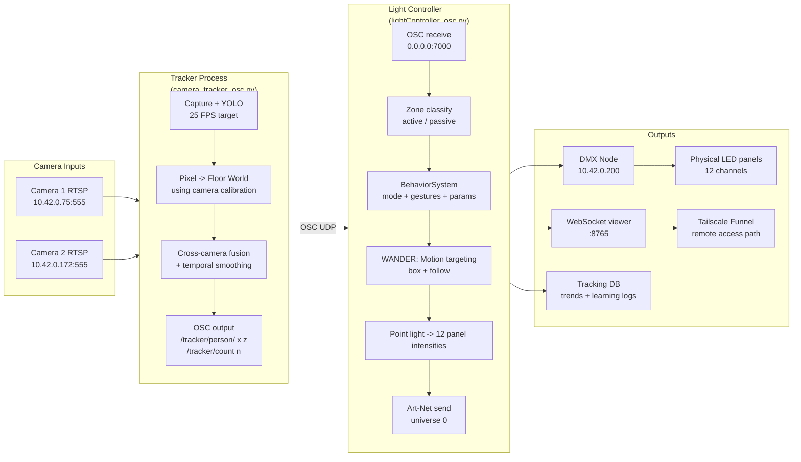

---

## 2) Runtime Services and Startup Order

This diagram shows how runtime processes are started and kept alive in production. It highlights that the light controller depends on network and camera tracker readiness, then runs with automatic restart policies. This helps explain why OSC and DMX are stable even during transient failures.

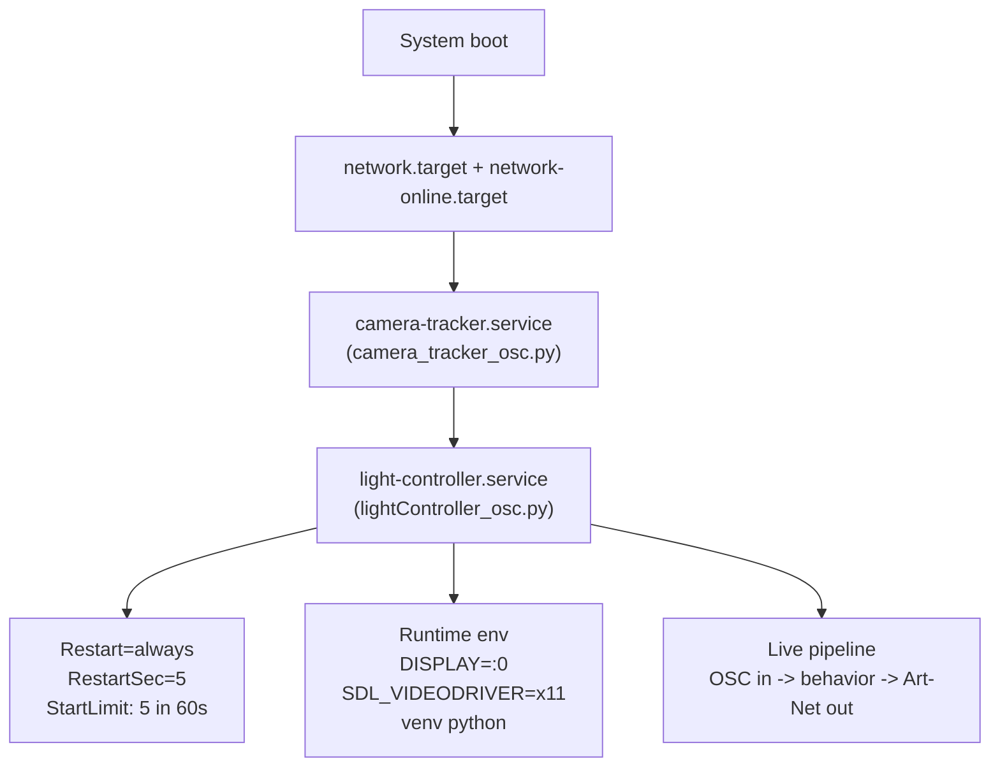

---

## 3) Data Contract Between Tracker and Controller

This sequence focuses on message-level handoff between tracking and behavior layers. The important idea is that the tracker sends only person positions and counts, while all meaning (zones, modes, gestures, tuning, wander-box movement boundaries) is decided downstream by the controller. The loop cadence also clarifies where latency and responsiveness are controlled.

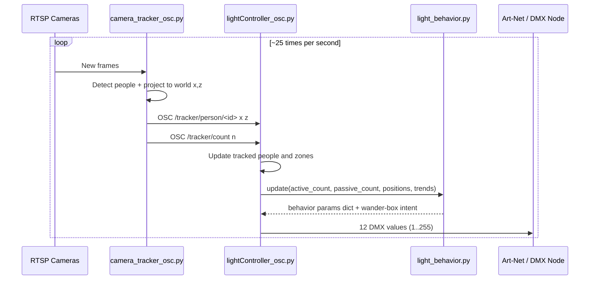

---

## 4) Tracker Pipeline (Inside `camera_tracker_osc.py`)

This is the internal tracking chain from frame capture to OSC output. It shows where live slider settings affect the result: detection confidence, camera fusion distance, and temporal smoothing. The output of this stage is a stable stream of world-space person positions, not lighting decisions.

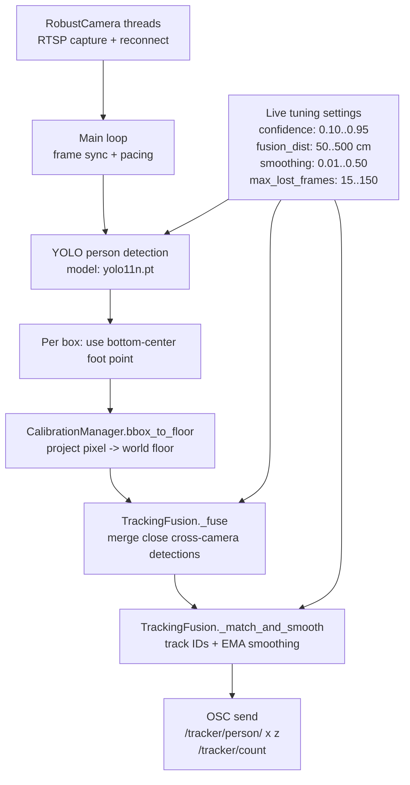

---

## 5) Calibration Geometry (Pixel to World Floor)

This diagram explains how an image-space foot point becomes a physical floor coordinate. Calibration values define camera geometry, and a ray-floor intersection gives each person location in centimeters. If this stage is off, all downstream behavior can look wrong even when detection itself is good.

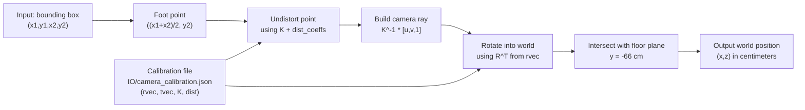

**Plain-language note**
- The tracker finds each person in image pixels.
- Calibration converts that image point into a real floor location in centimeters.
- That floor location is what behavior uses.

---

## 6) Controller Frame Loop (Inside `lightController_osc.py`)

This is the runtime heartbeat of the light controller. It combines incoming tracked people with behavior logic, wander/follow target selection, panel brightness calculation, and output publishing. It also shows where observability data is emitted to the database and WebSocket viewer.

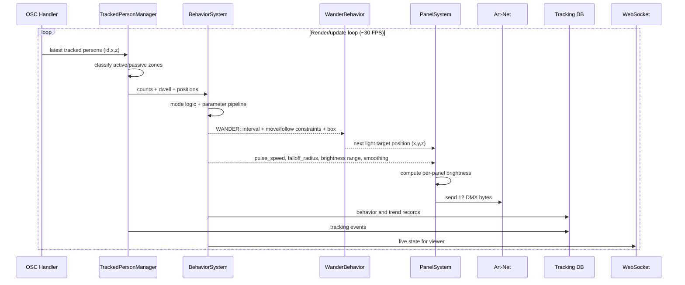

---

## 7) Behavior Mode State Machine (Runtime Values)

This state machine defines the light’s base personality before overlays are applied. Each mode sets a baseline for movement speed, brightness range, pulse period, falloff radius, and wander behavior profile. Stickiness and minimum-duration guards prevent jittery mode flipping when people move around quickly.

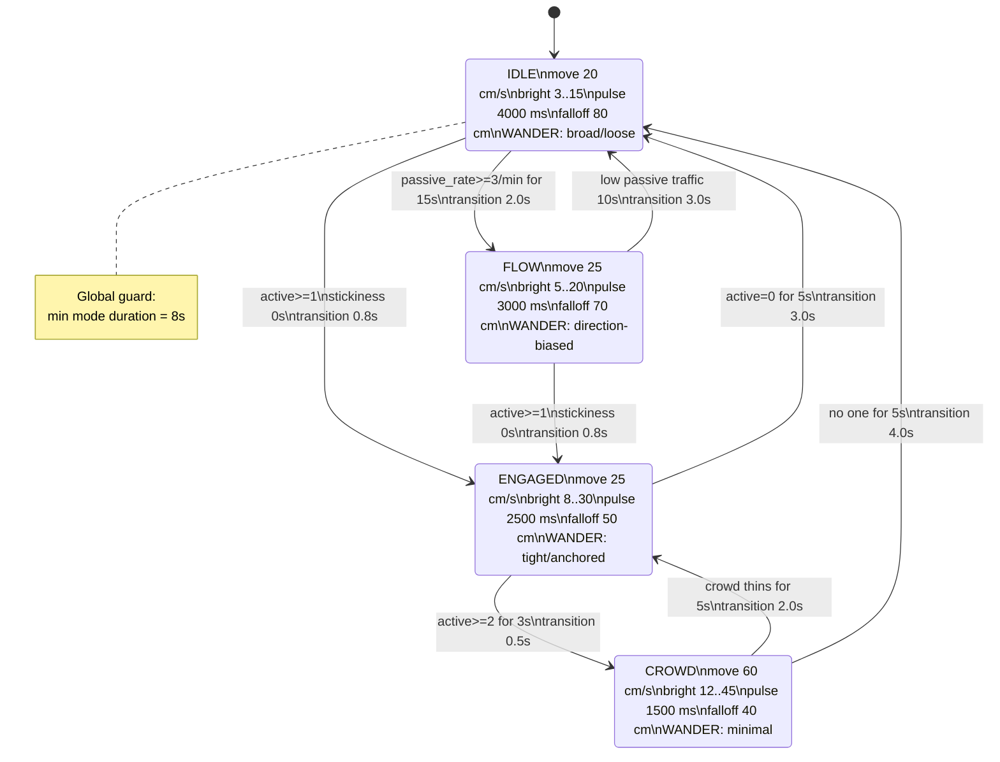

---

## 8) Behavior Parameter Pipeline (Frame-by-Frame)

This pipeline shows how one frame’s final behavior parameters are built step by step. Mode defaults are progressively reshaped by transitions, context, engagement depth, trend signals, and personality controls. The result is a stable parameter bundle that drives both movement behavior and panel intensity rendering.

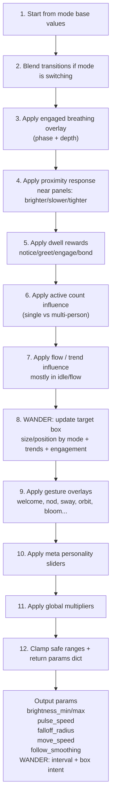

---

## 9) Wander Box: Behavior Inputs to Motion Output

This diagram makes the wander box role explicit. Behavior state and meta parameters continuously reshape the wander box, which constrains where the light can pick targets when it is not tightly following a person. That target selection then changes point-light position, which directly changes panel distances and final DMX values.

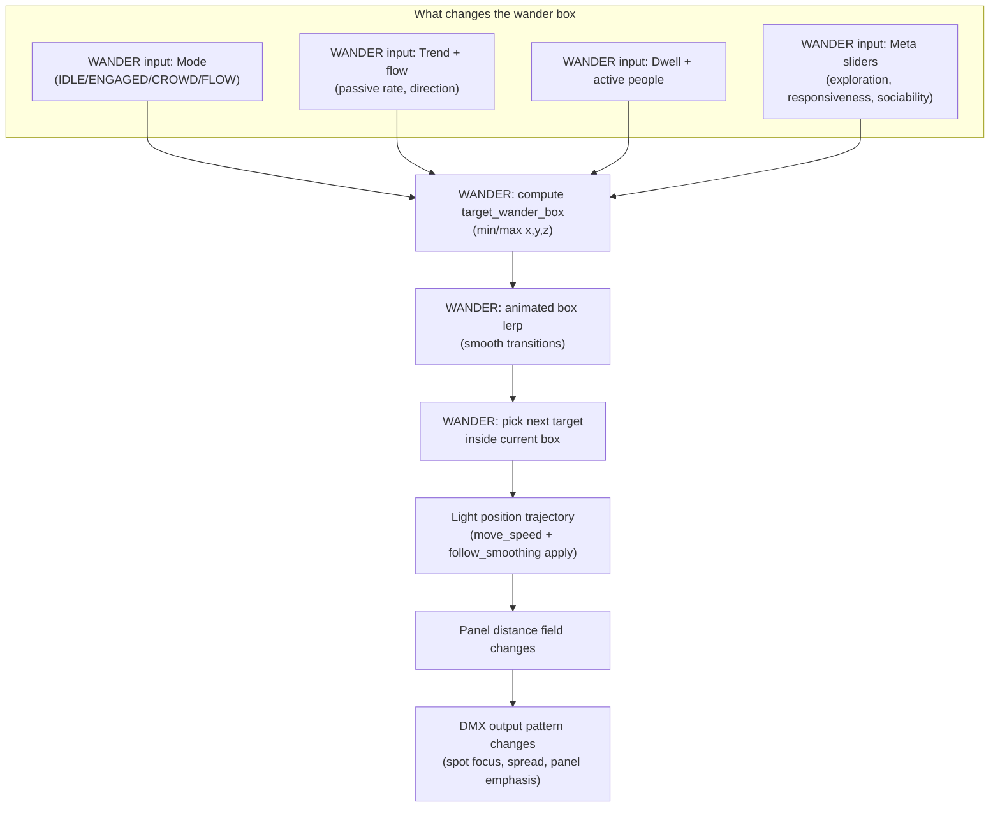

### Wander box mechanics (runtime values)

- Base wander box starts near the panels: `x: -290..-30`, `y: 0..150`, `z: -32..28`.
- Box transitions are smoothed (`wander_box_lerp_speed = 3.0`) so motion does not jump when mode/context changes.
- In engagement, behavior can contract movement around people using tight paddings (`±15cm x`, `±35cm y`, `±15cm z`) and controlled approach limits (`z` clamped roughly `-32..60`).

### Worked example: IDLE vs ENGAGED

When discussing output impact, this is the simplest practical comparison:

| Stage | IDLE (no active person) | ENGAGED (1 active person) |
|---|---|---|
| Mode baseline | `move_speed=20`, `wander_interval=5.0`, `falloff=80` | `move_speed=25`, `wander_interval=4.0`, `falloff=50`, `follow_smoothing=0.03` |
| Wander box behavior | Uses broader base box, chooses exploratory targets | Contracts/anchors around person; target updates stay close to person |
| Position path | Slower, wider drift across panel span | Tighter, more deliberate tracking near person position |
| DMX result | Wider illumination spread, gentler panel transitions | More localized hotspots, stronger panel contrast, faster local changes |

In plain terms: the wander box is the movement boundary that decides *where* the light can go between updates. Behavior parameters decide *how fast and how tightly* it moves inside that boundary. Together they strongly shape the spatial pattern of DMX output, not just brightness.

### Mini scenario: passive flow shifts panel emphasis (10-20s)

This timeline shows a common street condition: people move through passive zone mostly left-to-right while nobody is actively engaged. The behavior system treats that as directional flow pressure and shifts wander preference toward the incoming side. As the point light trajectory shifts, panel distance relationships change and DMX emphasis follows.

```mermaid
flowchart LR
    T0["t=0s\nNo active person\nMode: IDLE or FLOW candidate"] --> T1["t=0..10s\nPassive detections accumulate\nflow tracker updates (~1.5s)"]
    T1 --> T2["t~10..15s\nSustained direction signal\n(passive_rate + flow_direction)"]
    T2 --> T3["WANDER: nudge box center\nin flow direction"]
    T3 --> T4["WANDER: target picks bias\ntoward shifted side"]
    T4 --> T5["Light path drifts to that side\nover multiple updates"]
    T5 --> T6["Nearest panels on that side brighten more often\nfar-side panels dim more often"]
    T6 --> T7["Observed output: directional DMX emphasis\nwithout full hard switch"]
```

Practical read: this is one reason output can look intentionally directional even when nobody is standing in the active zone. The wander box is carrying crowd-flow context into spatial light behavior.

---

## 10) Meta Parameters -> Actual Light Behavior

This view isolates personality controls from mode logic. It shows how sliders and global multipliers shape concrete output parameters like speed, pulse timing, brightness, follow tightness, and roaming behavior in the wander box. Use this to explain why two runs with the same tracked people can still feel behaviorally different.

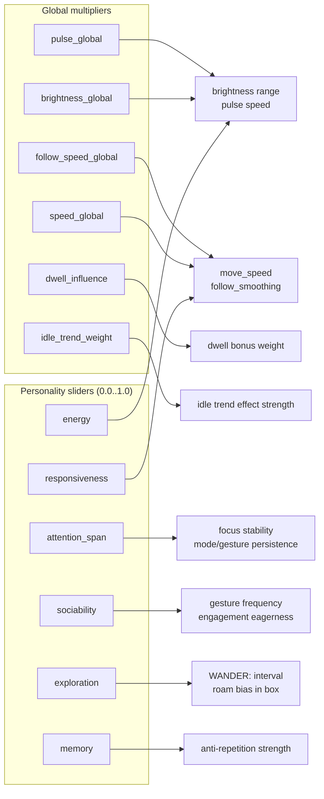

**Example mapping used in code**
- `move_speed *= lerp(0.6, 1.4, responsiveness) * speed_global`
- `pulse_speed *= lerp(1.3, 0.7, energy) * pulse_global`
- `brightness_max *= lerp(0.7, 1.3, energy) * brightness_global`
- `wander_interval *= lerp(1.5, 0.5, exploration)` (changes how often targets are picked inside the wander box)

---

## 11) Auto-Tuning Loop (Every 5 Seconds)

This is the short-timescale adaptation loop that keeps the light responsive to current street activity. It computes bounded parameter changes, applies safety constraints, and uses a budget mechanism to avoid abrupt over-adjustment. Over time, this loop changes the personality and global multipliers while staying within safe operating limits.

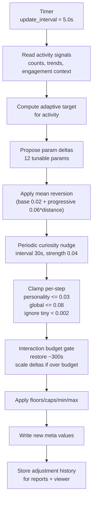

### Runtime auto-tuning constraints (key values)

| Parameter | Min | Max | Safe floor | Soft cap | Home value |
|---|---:|---:|---:|---:|---:|
| responsiveness | 0.0 | 1.0 | 0.30 | 0.90 | 0.50 |
| energy | 0.0 | 1.0 | 0.25 | 0.85 | 0.45 |
| attention_span | 0.0 | 1.0 | 0.10 | — | 0.50 |
| sociability | 0.0 | 1.0 | 0.20 | — | 0.45 |
| exploration | 0.0 | 1.0 | 0.15 | — | 0.40 |
| memory | 0.0 | 1.0 | — | — | 0.30 |
| brightness_global | 0.2 | 5.0 | 0.60 | 3.00 | 1.20 |
| speed_global | 0.2 | 2.0 | 0.35 | 1.60 | 0.70 |
| pulse_global | 0.3 | 3.0 | 0.35 | 2.00 | 0.80 |
| follow_speed_global | 0.5 | 3.0 | 0.60 | — | 1.00 |
| dwell_influence | 0.0 | 2.0 | — | — | 0.50 |
| idle_trend_weight | 0.0 | 2.0 | 0.10 | — | 0.40 |

---

## 12) Feedback and Meta-Tuning Layer

This is the slower learning loop above the 5-second tuner. Historical analysis writes override settings that retune the tuner itself, then runtime hot-reloads those settings without restarting the process. In practice, this prevents drift and helps the system evolve over days instead of only reacting second-to-second.

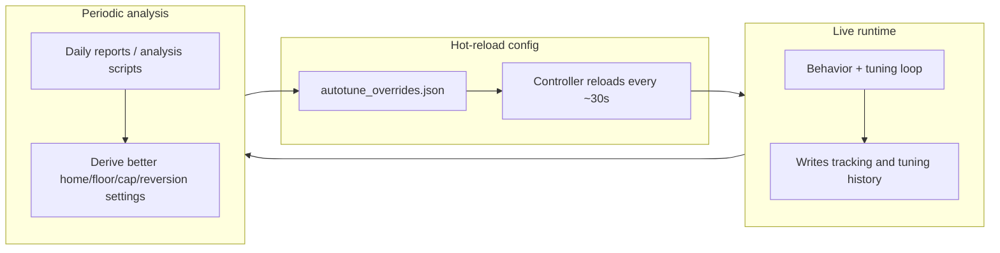

**What this loop achieves**
- The 5-second loop keeps behavior responsive in the moment.
- The review layer adjusts the tuner itself over longer periods.
- Together, the light adapts without drifting into unusable extremes.

---

## 13) Final Step: Point Light to 12 DMX Channels

This is the last transform from behavior state to physical output. The point light and falloff model produce per-panel intensity values, and each is mapped to a DMX byte for Art-Net transmission. The same behavior parameters therefore influence output both indirectly through wander-box-constrained position and directly through brightness/pulse/falloff settings.

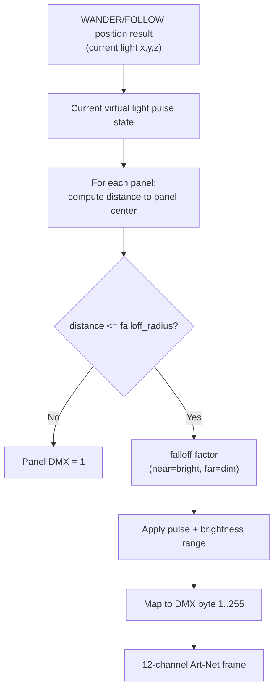

**Key visual lever**
- `falloff_radius` has the strongest impact on overall look:
  - smaller radius -> tighter spotlight
  - larger radius -> broader wash

---

## Terms (quick glossary)

- **Active zone**: where people are treated as engaging with the installation.
- **Passive zone**: sidewalk traffic area that can influence behavior without direct engagement.
- **Wander box**: the current allowed movement boundary for the light target (`min/max x,y,z`), continuously updated by behavior context.
- **Meta parameters**: personality sliders and global multipliers that reshape mode defaults.
- **Auto-tuning**: the 5-second adjustment loop that updates meta parameters.
- **Meta-tuning**: slower review process that updates auto-tuner configuration.

---

## Notes for operators

- This document assumes tracker calibration is loaded from `IO/camera_calibration.json`.
- If your calibrated file is currently in `calibration/camera_calibration.json`, copy or sync it to the runtime path used by `camera_tracker_osc.py`.
