# Drop Ceiling — Camera to DMX Diagrams (Runtime-Focused)

A plain-language diagram set that traces the live system from camera input to Art-Net DMX output.

This file is intentionally separate from `BEHAVIOR_DIAGRAMS.md`.
It is based on the runtime stack centered on:
- `IO/camera_tracker_osc.py`
- `IO/lightController_osc.py`
- `IO/light_behavior.py`
- `IO/systemd/light-controller.service`
- `IO/camera_calibration.py`

> Audience: coding-literate readers who want clear system understanding without heavy jargon.

---

## 1) End-to-End System Overview

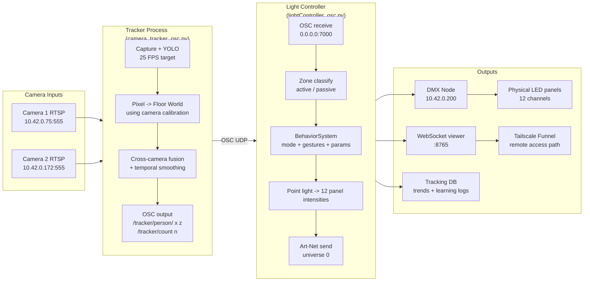

---

## 2) Runtime Services and Startup Order

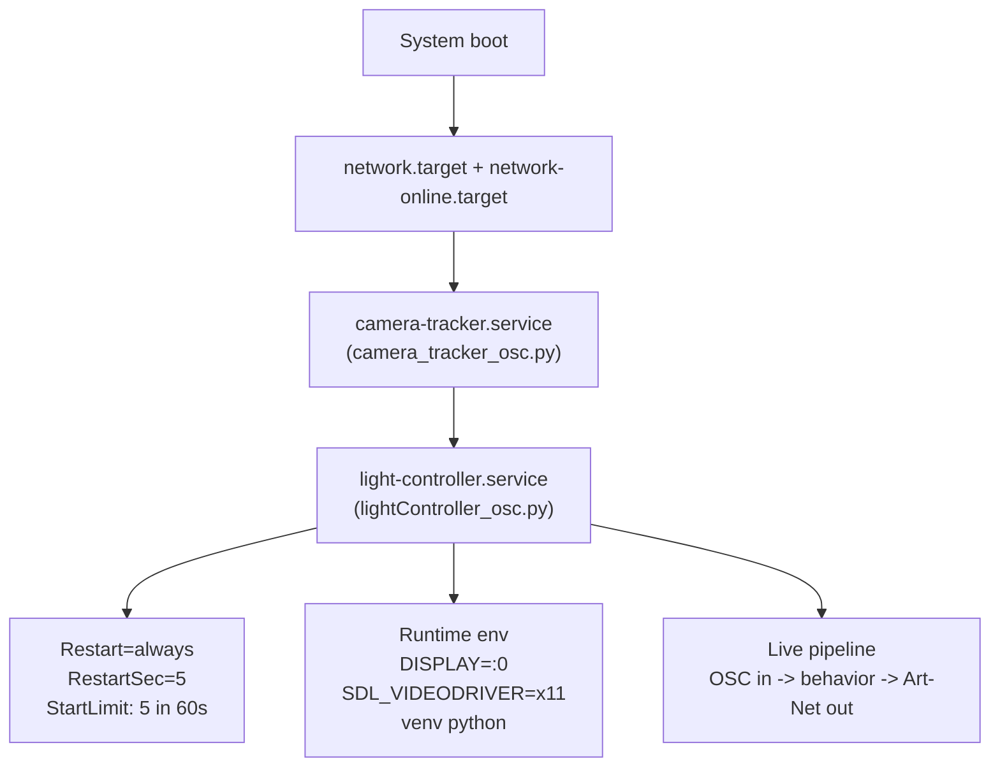

---

## 3) Data Contract Between Tracker and Controller

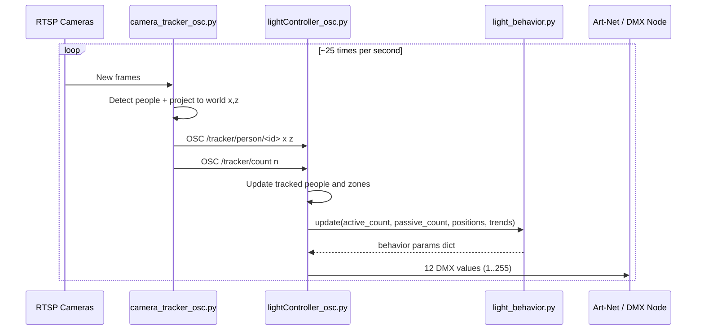

---

## 4) Tracker Pipeline (Inside `camera_tracker_osc.py`)

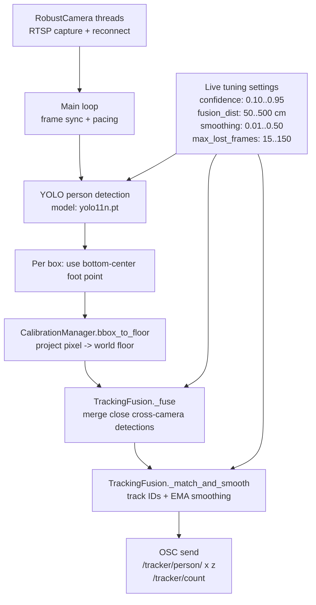

---

## 5) Calibration Geometry (Pixel to World Floor)

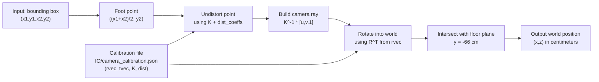

**Plain-language note**
- The tracker finds each person in image pixels.
- Calibration converts that image point into a real floor location in centimeters.
- That floor location is what behavior uses.

---

## 6) Controller Frame Loop (Inside `lightController_osc.py`)

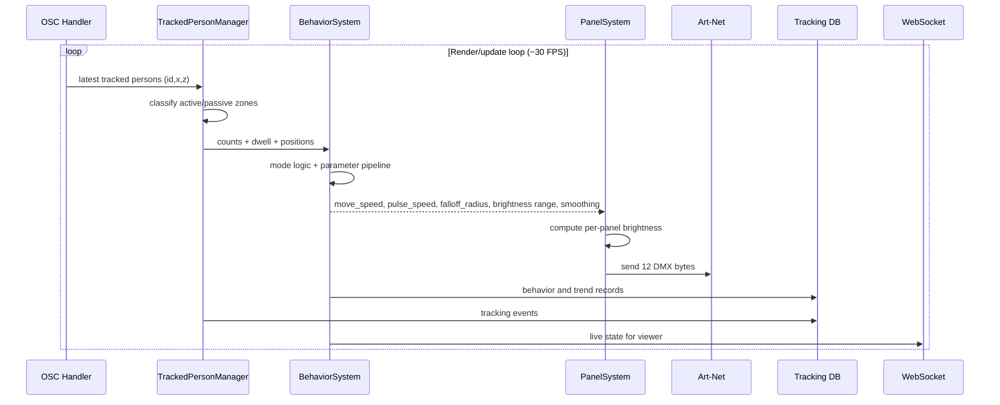

---

## 7) Behavior Mode State Machine (Runtime Values)

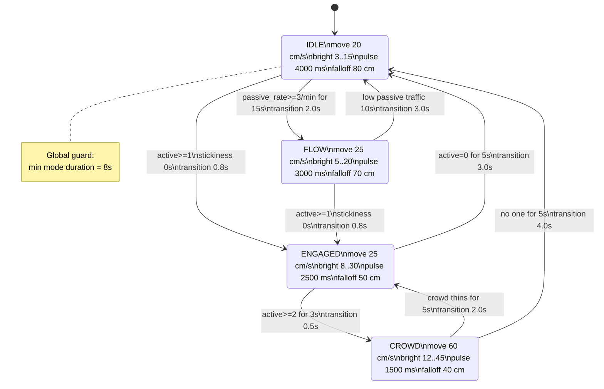

---

## 8) Behavior Parameter Pipeline (Frame-by-Frame)

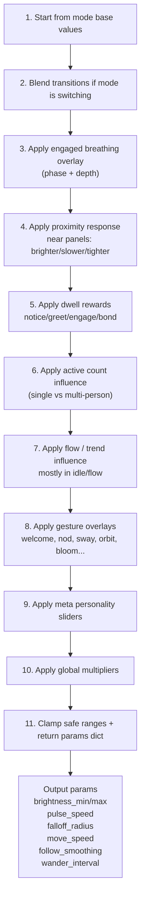

---

## 9) Meta Parameters -> Actual Light Behavior

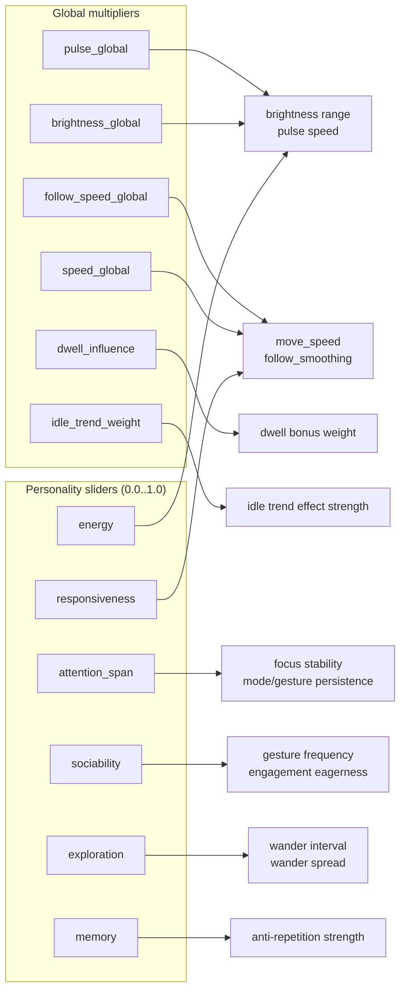

**Example mapping used in code**
- `move_speed *= lerp(0.6, 1.4, responsiveness) * speed_global`
- `pulse_speed *= lerp(1.3, 0.7, energy) * pulse_global`
- `brightness_max *= lerp(0.7, 1.3, energy) * brightness_global`

---

## 10) Auto-Tuning Loop (Every 5 Seconds)

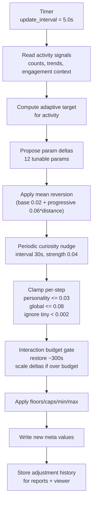

### Runtime auto-tuning constraints (key values)

| Parameter | Min | Max | Safe floor | Soft cap | Home value |
|---|---:|---:|---:|---:|---:|
| responsiveness | 0.0 | 1.0 | 0.30 | 0.90 | 0.50 |
| energy | 0.0 | 1.0 | 0.25 | 0.85 | 0.45 |
| attention_span | 0.0 | 1.0 | 0.10 | — | 0.50 |
| sociability | 0.0 | 1.0 | 0.20 | — | 0.45 |
| exploration | 0.0 | 1.0 | 0.15 | — | 0.40 |
| memory | 0.0 | 1.0 | — | — | 0.30 |
| brightness_global | 0.2 | 5.0 | 0.60 | 3.00 | 1.20 |
| speed_global | 0.2 | 2.0 | 0.35 | 1.60 | 0.70 |
| pulse_global | 0.3 | 3.0 | 0.35 | 2.00 | 0.80 |
| follow_speed_global | 0.5 | 3.0 | 0.60 | — | 1.00 |
| dwell_influence | 0.0 | 2.0 | — | — | 0.50 |
| idle_trend_weight | 0.0 | 2.0 | 0.10 | — | 0.40 |

---

## 11) Feedback and Meta-Tuning Layer

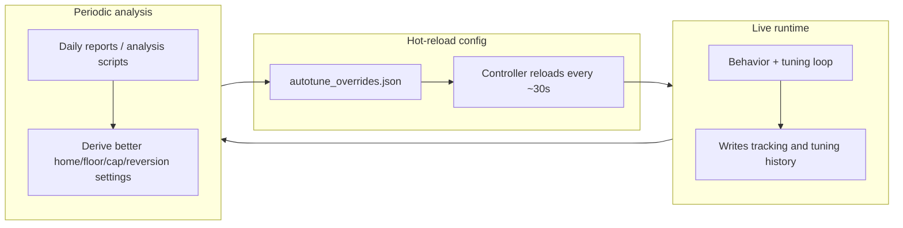

**What this loop achieves**
- The 5-second loop keeps behavior responsive in the moment.
- The review layer adjusts the tuner itself over longer periods.
- Together, the light adapts without drifting into unusable extremes.

---

## 12) Final Step: Point Light to 12 DMX Channels

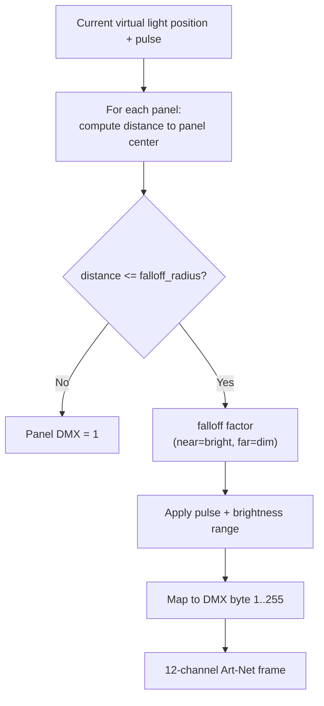

**Key visual lever**
- `falloff_radius` has the strongest impact on overall look:
  - smaller radius -> tighter spotlight
  - larger radius -> broader wash

---

## Terms (quick glossary)

- **Active zone**: where people are treated as engaging with the installation.
- **Passive zone**: sidewalk traffic area that can influence behavior without direct engagement.
- **Meta parameters**: personality sliders and global multipliers that reshape mode defaults.
- **Auto-tuning**: the 5-second adjustment loop that updates meta parameters.
- **Meta-tuning**: slower review process that updates auto-tuner configuration.

---

## Notes for operators

- This document assumes tracker calibration is loaded from `IO/camera_calibration.json`.
- If your calibrated file is currently in `calibration/camera_calibration.json`, copy or sync it to the runtime path used by `camera_tracker_osc.py`.
