# Drop Ceiling — Step-by-Step Complexity Expansion

How the system grew from 12 sliders to a self-learning light organism. Each step adds one new concept on top of the previous one. Diagrams use [Mermaid](https://mermaid.js.org/) syntax.

> For the full architectural reference, see [BEHAVIOR_DIAGRAMS.md](BEHAVIOR_DIAGRAMS.md).

---

# 1 — Control 12 DMX Values Directly with 12 Sliders

The initial step was to test the hardware and software configuration to confirm that the LED panels could be controlled in real time by the software.

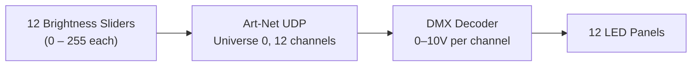

### Inputs
| Input | Type | Range |
|---|---|---|
| Brightness per panel | Slider × 12 | 0 – 255 |

### Output
- 12 DMX values (0 – 255) → Art-Net → DMX Decoder → 0 – 10V per panel

### Key Parameters
| Parameter | Value |
|---|---|
| DMX channels | 12 (1 per panel) |
| Art-Net target | 10.42.0.200 |
| Universe | 0 |

---

# 2 — Virtual Point Light

After testing several methods (wave fields, spring physics, radial gradients, vector controllers), a spatial control system emerged: a **virtual point light** that illuminates each panel based on the light's brightness and distance to the panel. A virtual sensor at the center of each panel reads the value based on the initial light value and the **falloff distance**. This meant 12 independent channels could be controlled with just 3 spatial parameters.

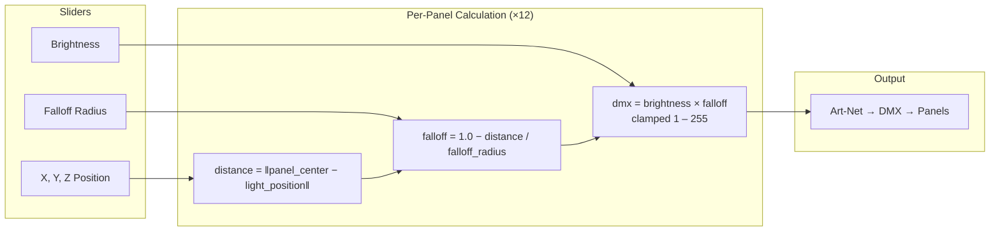

### Inputs
| Input | Type | Range |
|---|---|---|
| Light X position | Slider | −290 to −30 cm |
| Light Y position | Slider | 0 to 150 cm |
| Light Z position | Slider | −32 to 28 cm |
| Brightness | Slider | 0 – 255 |
| Falloff Radius | Slider | 20 – 200 cm |

### Output
- 12 DMX values computed from distance-based falloff

### Key Parameters
| Parameter | Value |
|---|---|
| Panel layout | 4 units × 3 panels |
| Unit spacing | 80 cm center-to-center |
| Unit X positions | −30, −110, −190, −270 cm |
| Panel Y positions | 90 cm (top), 30 cm (lower two) |
| Panel Z positions | 0 cm (top), ±12 cm (lower, angled 22.5°) |

### What This Unlocked
Changing from 12 independent sliders to a single spatial light source meant the output was **spatially coherent** — panels near the light were always brighter than panels far away, without manual coordination.

---

# 3 — Animated Point Light Controller

The next stage moved from **direct manual control** to **animated movement** within a fixed area. Instead of positioning sliders, the user clicks to set a target position and the light lerps toward it. A **pulse cycle** (sine wave) was added to make the light breathe between a min and max brightness.

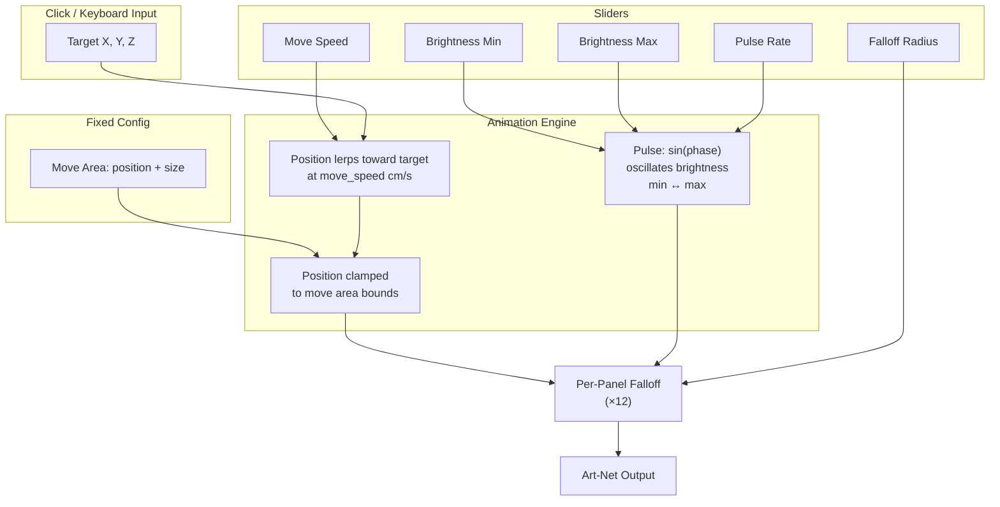

### Inputs
| Input | Type | Range |
|---|---|---|
| Move Speed | Slider | 5 – 100 cm/s |
| Brightness Min | Slider | 0 – 255 |
| Brightness Max | Slider | 0 – 255 |
| Pulse Rate | Slider | 500 – 8000 ms |
| Falloff Radius | Slider | 20 – 200 cm |
| Target X, Y, Z | Click / Arrow keys | Within move area |
| Move Area | Fixed config | Position + Size (X, Y, Z) |

### Output
- Animated light position + pulsing brightness → 12 DMX values

### Key Parameters
| Parameter | Value |
|---|---|
| Default move area | 260 × 150 × 60 cm |
| Pulse method | `sin(phase)` oscillating 0.0 – 1.0 |
| Brightness equation | `brightness_min + pulse × (brightness_max − brightness_min)` |
| Position interpolation | Linear lerp at `move_speed` cm/s |

### What This Unlocked
The light was now **alive** — it moved on its own, breathed, and had a spatial boundary. But it had no awareness of people.

---

# 4 — OSC Input: Pedestrian Data

The first connection between **real-world tracking** and the light. A pedestrian simulator (and later real cameras) sends person positions over OSC. The light now receives X, Z coordinates for each tracked person.

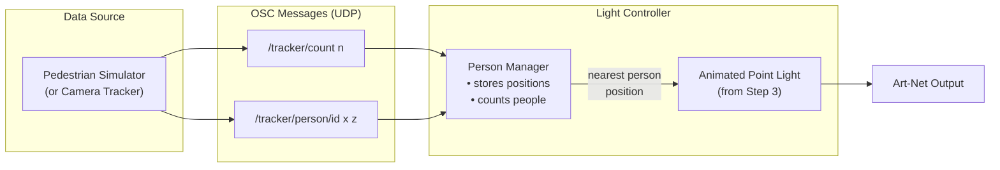

### Inputs
| Input | Type | Range |
|---|---|---|
| `/tracker/count` | OSC int | 0 – N |
| `/tracker/person/<id>` | OSC float × 2 | X (cm), Z (cm) |
| All Step 3 sliders | Slider | same as above |

### Output
- Same as Step 3, but light target now follows person positions

### Key Parameters
| Parameter | Value |
|---|---|
| OSC port | 7000 |
| Protocol | UDP |
| Update rate | ~25 Hz |
| Simulator pedestrian types | PASSIVE (walk-through), ACTIVE (wander), CURIOUS (enter-and-explore) |

### What This Unlocked
The light could now **respond to people**. But it treated every person the same — no concept of engagement, zones, or behavioral modes.

---

# 5 — Zone Classification: Active vs Passive

People are now classified into **two zones** based on their Z coordinate. The **active zone** is directly under the panels where people are "engaging." The **passive zone** is the sidewalk traffic beyond. This single classification drives all future behavioral decisions.

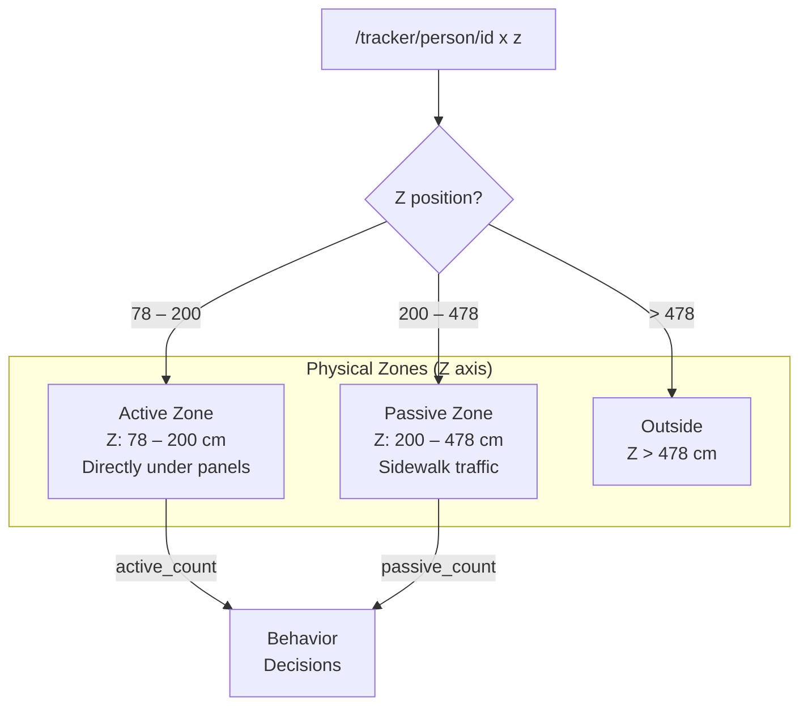

### Inputs
| Input | Type |
|---|---|
| Person X, Z | OSC float × 2 |

### Key Parameters
| Parameter | Value |
|---|---|
| Active zone depth | ~120 cm (directly under panels) |
| Passive zone depth | ~270 cm (sidewalk beyond) |
| Zone boundaries | Loaded from `world_coordinates.json` |

### What This Unlocked
The system now knows the **difference between someone standing under the installation and someone walking past on the sidewalk**. This is the foundation of all behavioral modes.

---

# 6 — Four Behavioral Modes

The light is always in one of four modes based on zone occupancy. Each mode defines a **base personality** — how fast the light moves, how bright it shines, and whether it follows someone or wanders on its own.

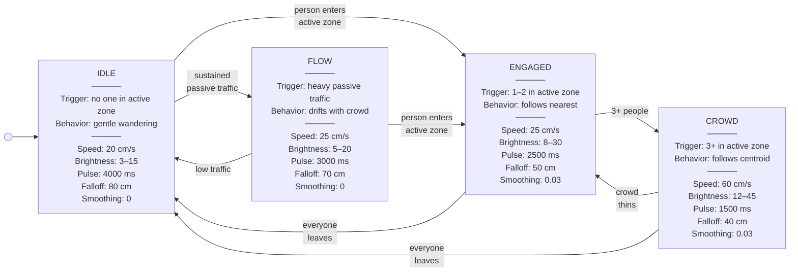

### Mode Base Parameters

| Parameter | IDLE | ENGAGED | CROWD | FLOW |
|---|---|---|---|---|
| `move_speed` | 20 cm/s | 25 cm/s | 60 cm/s | 25 cm/s |
| `brightness_min` | 3 | 8 | 12 | 5 |
| `brightness_max` | 15 | 30 | 45 | 20 |
| `pulse_speed` | 4000 ms | 2500 ms | 1500 ms | 3000 ms |
| `falloff_radius` | 80 cm | 50 cm | 40 cm | 70 cm |
| `follow_smoothing` | 0 | 0.03 | 0.03 | 0 |
| `wander_interval` | 5.0 s | 4.0 s | 0.0 s | 3.0 s |

### What This Unlocked
The light now has **distinct behaviors** depending on who's around. An empty sidewalk gets a gentle wander; a person standing under the panels gets direct attention; a group gets high energy. The transition between modes is the first step toward the light feeling intentional.

---

# 7 — Mode Transition Smoothing

Raw mode switching causes **jarring jumps** — brightness snapping from 15 to 45 in a single frame. This step adds **stickiness timers** (conditions must persist before switching) and **transition interpolation** (parameters lerp from old to new values over time).

```mermaid
flowchart LR
    subgraph STICKINESS["Stickiness Timers"]
        S1["IDLE→ENGAGED: 0s (immediate)"]
        S2["ENGAGED→IDLE: 5s delay"]
        S3["ENGAGED→CROWD: 3s with 3+ people"]
        S4["IDLE→FLOW: 15s sustained traffic"]
        S5["Mode guard: min 8s in any mode"]
    end

    subgraph TRANSITION["Transition Interpolation"]
        T1["IDLE→ENGAGED: 0.8s (quick)"]
        T2["ENGAGED→IDLE: 3.0s (slow goodbye)"]
        T3["ENGAGED→CROWD: 0.5s (quick)"]
        T4["CROWD→IDLE: 4.0s (slow fade)"]
    end

    STICKINESS -->|"conditions\npersist"| TRANSITION -->|"lerp old→new\nall 7 params"| OUTPUT["Smooth\nParameter\nChange"]
```

### Key Parameters
| Transition | Stickiness | Interpolation |
|---|---|---|
| IDLE → ENGAGED | 0 s (immediate) | 0.8 s |
| ENGAGED → IDLE | 5 s | 3.0 s |
| ENGAGED → CROWD | 3 s | 0.5 s |
| CROWD → ENGAGED | 5 s | 2.0 s |
| CROWD → IDLE | 5 s | 4.0 s |
| IDLE → FLOW | 15 s | 2.0 s |
| FLOW → IDLE | 10 s | 3.0 s |
| FLOW → ENGAGED | 0 s (immediate) | 0.8 s |
| Min mode duration | 8 s (any mode) | — |

### Design Choice
**Engaging is fast (0.5–0.8 s), disengaging is slow (2.0–4.0 s).** The light is eager to connect and reluctant to let go.

---

# 8 — Wander Box: Spatial Constraint

Instead of roaming freely, the light picks random targets inside a **3D bounding volume** (the wander box) and lerps toward them. In IDLE, the box spans the full panel array. In ENGAGED, the box **contracts and anchors around the person**. All future modifiers work by **reshaping the box**, not by steering the light directly.

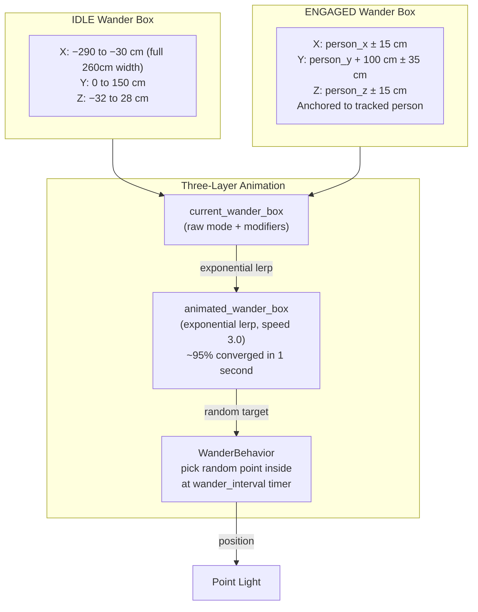

### Key Parameters
| Parameter | Value |
|---|---|
| IDLE box width | 260 cm (full array) |
| ENGAGED contraction | ±15 cm around person |
| 2 people weighting | 70/30 toward nearest |
| 3+ people | Centroid of all positions |
| Animation lerp speed | 3.0 (exponential, ~1s converge) |
| Wander interval (IDLE) | 5.0 s |
| Wander interval (ENGAGED) | 4.0 s |
| Position lerp | 3% per frame |

### What This Unlocked
The light's movement now has **spatial intent**. In IDLE it drifts broadly; in ENGAGED it orbits the person. The same wander mechanism drives both — only the box dimensions change.

---

# 9 — Gesture System (10 Types)

Short animations that interrupt the normal wander pattern to give the light **expressive texture**. Gestures fire based on conditions (someone entering, someone leaving, boredom) and are weighted by cooldowns and context.

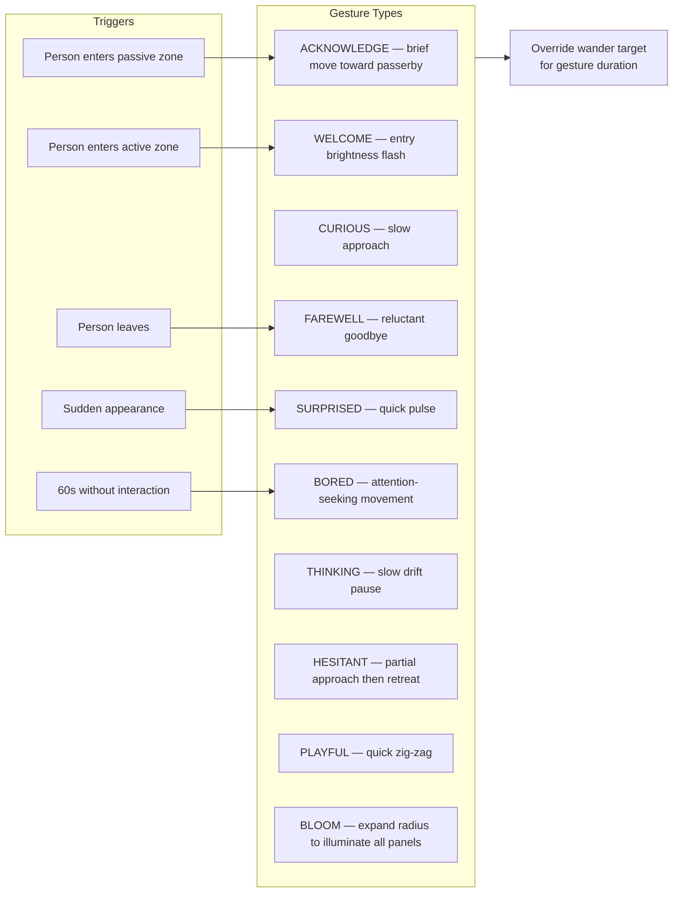

### Key Parameters
| Parameter | Value |
|---|---|
| Bloom cooldown | 45 s |
| Bloom duration | 3.0 s |
| Bloom chance | ~15% per minute |
| Bloom radius | 300 cm (covers all panels) |
| Welcome flash | +25 brightness, 0.8 s |
| Boredom threshold | 60 s without interaction |

### What This Unlocked
The light can now **express itself** — welcoming newcomers, seeking attention when bored, saying reluctant goodbyes. These are short punctuations on top of the continuous mode behavior.

---

# 10 — Personality System: 6 MetaParameter Sliders

A layer of abstraction above the mode base values. Six personality sliders (0.0 – 1.0) define the light's **character**, and six global multipliers scale the final output. Together they transform the hard-coded mode values into something tuneable and expressive.

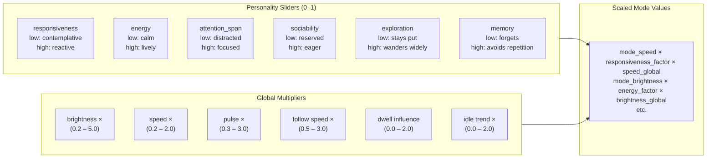

### How Personality Maps to Output
| Slider | Affects | Low (0.0) | High (1.0) |
|---|---|---|---|
| responsiveness | `move_speed`, `follow_smoothing` | ×0.6 (slow) | ×1.4 (fast) |
| energy | `pulse_speed`, `brightness` | ×1.3 period (slow), ×0.7 bright | ×0.7 period (fast), ×1.3 bright |
| attention_span | gesture selection | distracted, short gestures | focused, SETTLE gestures |
| sociability | gesture frequency | ×1.5 interval (rare) | ×0.5 interval (frequent) |
| exploration | `wander_interval` | ×1.5 (slow picks) | ×0.5 (fast picks) |
| memory | anti-repetition strength | 0 (no suppression) | 1.0 (strong suppression) |

### Example Calculation
With `responsiveness = 0.8` and `speed_global = 1.2` in IDLE mode:
- Base speed: 20 cm/s
- Responsiveness factor: lerp(0.6, 1.4, 0.8) = **1.24**
- Final: 20 × 1.24 × 1.2 = **29.8 cm/s**

---

# 11 — Time-of-Day Modifiers

The light's behavior shifts based on the hour of day. A financial district location means rush hours have commuters who won't stop, mid-day has explorers, and nighttime is dead. The system scales brightness and pulse accordingly.

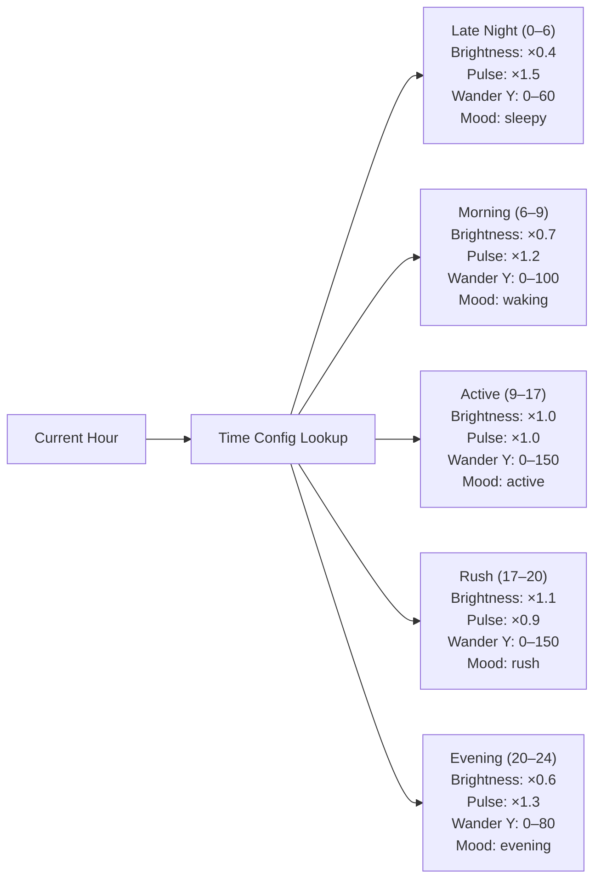

### Key Parameters
| Period | Hours | Brightness × | Pulse × | Max Wander Y |
|---|---|---|---|---|
| Late night | 0 – 6 | 0.4 | 1.5 | 60 cm |
| Morning | 6 – 9 | 0.7 | 1.2 | 100 cm |
| Active | 9 – 17 | 1.0 | 1.0 | 150 cm |
| Rush | 17 – 20 | 1.1 | 0.9 | 150 cm |
| Evening | 20 – 24 | 0.6 | 1.3 | 80 cm |

---

# 12 — Dwell Phase System

When someone stays in the active zone, the interaction deepens through four progressive **dwell phases**. Each phase increases the light's intimacy and commitment.

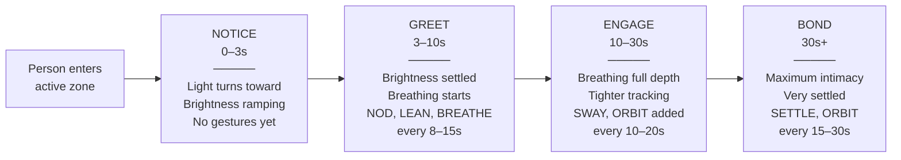

### Dwell Phase Parameters
| Phase | Time | Breathing Depth | Gesture Interval | New Gestures |
|---|---|---|---|---|
| Notice | 0 – 3 s | 0 (none) | none | — |
| Greet | 3 – 10 s | 0.4 (subtle) | 8 – 15 s | NOD, LEAN, BREATHE |
| Engage | 10 – 30 s | 0.7 | 10 – 20 s | + SWAY, ORBIT |
| Bond | 30 s+ | 1.0 (full) | 15 – 30 s | + SETTLE |

### Dwell Bonus
Brightness and follow smoothing increase with dwell time, scaled by the `dwell_influence` global multiplier (default 1.0, range 0.0 – 2.0).

---

# 13 — Engaged Interaction Gestures + Breathing Overlay

Six new gesture types for **ongoing engagement** (added on top of the original 10), plus a continuous **breathing overlay** — a slow sine wave that modulates brightness and falloff radius to make the light feel alive.

### 6 Engaged Gestures
| Gesture | Duration | Motion | Phase-Gated |
|---|---|---|---|
| NOD | 1.0 – 1.2 s | Small Y bob (12 cm) | Greet+ |
| LEAN | 1.5 – 1.8 s | Brief Z shift toward person (15 cm) | Greet+ |
| SWAY | 3.0 – 4.0 s | Gentle lateral X oscillation (18 cm) | Engage+ |
| ORBIT | 4.0 – 5.0 s | Lazy circle (X: 15 cm, Y: 8 cm) | Engage+ |
| SETTLE | 3.0 s | Tighten Z by 8 cm, shrink radius by 10 | Bond |
| BREATHE | 4.0 – 6.0 s | Visible brightness wave | Greet+ |

### Breathing Overlay Parameters
| Parameter | Value |
|---|---|
| Ramp-up time | 8.0 s (0 → full depth) |
| Base period | 6.0 s per breath cycle |
| Brightness modulation | ±12% at full depth |
| Falloff radius modulation | ±6% at full depth |
| Phase rate | 1.047 rad/s (one cycle per 6 s) |
| Type | Multiplicative sine wave |

### What This Unlocked
The light now feels like it **breathes with you**. The deeper the engagement, the more synchronized the rhythm. Gestures add punctuation — a nod of acknowledgment, a gentle lean in, a comfortable sway.

---

# 14 — Camera Tracking Integration

The pedestrian simulator is replaced (or supplemented) by **real YOLO-based camera tracking**. Two Reolink PoE cameras capture RTSP video, YOLO 11n detects people, ArUco calibration projects pixel positions to floor coordinates, and cross-camera fusion produces stable tracks.

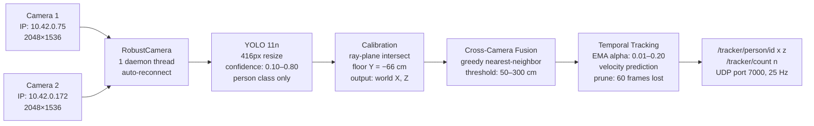

### Key Parameters
| Parameter | Value |
|---|---|
| Cameras | 2× Reolink RLC-520A |
| YOLO model | YOLO 11n |
| Detection resize | 416 px wide |
| Confidence range | 0.10 – 0.80 (slider) |
| Calibration method | ArUco markers (7) → solvePnP |
| Fusion threshold | 50 – 300 cm (slider) |
| EMA smoothing alpha | 0.01 – 0.20 (slider) |
| Track prune threshold | 60 frames unseen |
| Output rate | 25 Hz |

### Live Tuning Sliders (3)
| Slider | What It Does | Range |
|---|---|---|
| Confidence | YOLO detection threshold | 0.10 – 0.80 |
| Fusion Distance | Max merge distance across cameras | 50 – 300 cm |
| EMA Alpha | Track smoothing (low = smooth, high = responsive) | 0.01 – 0.20 |

---

# 15 — Proximity Response

A Z-distance-based modifier that changes the light's character when someone stands **close to the panels** vs **far away** at the edge of the active zone. Close means slower, brighter, more precise. Far means faster, dimmer, looser.

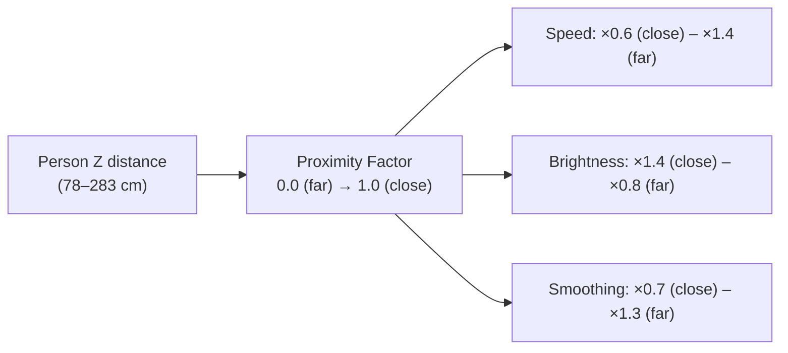

### Key Parameters
| Parameter | Near (Z ≤ 100 cm) | Far (Z ≥ 280 cm) |
|---|---|---|
| Speed multiplier | ×0.6 | ×1.4 |
| Brightness multiplier | ×1.4 | ×0.8 |
| Smoothing multiplier | ×0.7 | ×1.3 |
| Interpolation | Linear between near and far | |

---

# 16 — Trend Analysis: Multi-Timescale Windows

The system now tracks activity across **four rolling time windows** simultaneously. This gives the light awareness of not just "who's here now" but "how busy has it been?"

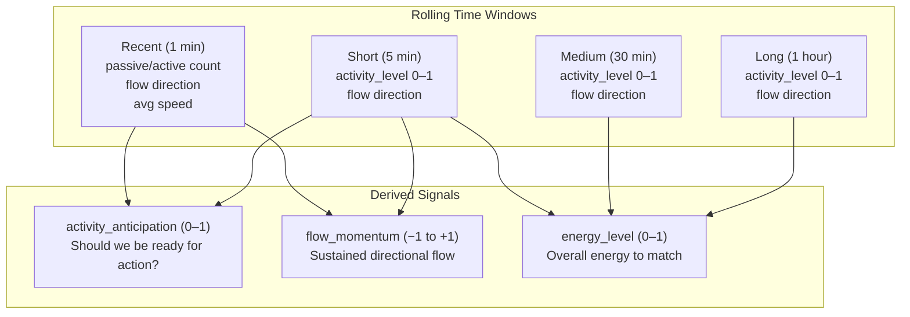

### Key Parameters
| Window | Duration | Updates | Primary Use |
|---|---|---|---|
| Recent | 1 min | continuous | Immediate reactivity |
| Short | 5 min | continuous | Auto-tuning primary signal |
| Medium | 30 min | continuous | General activity level |
| Long | 1 hour | continuous | Big-picture energy |

### What This Unlocked
The light now has **temporal awareness**. A quiet afternoon after a busy morning feels different than a quiet afternoon after a quiet morning.

---

# 17 — Flow Tracking: Directional Awareness

A fast-updating tracker that measures **which direction pedestrians are moving** through the passive zone. This shifts the wander box toward incoming traffic, creating directional light emphasis even when nobody is actively engaged.

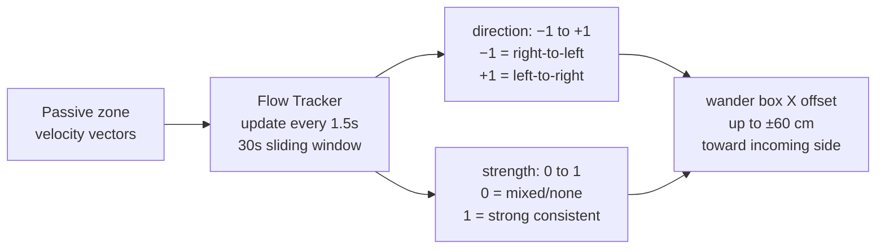

### Key Parameters
| Parameter | Value |
|---|---|
| Update interval | 1.5 s |
| Window duration | 30 s sliding |
| EMA alpha | 0.25 (responsive) |
| Max X offset | ±60 cm |
| Direction | −1 (right-to-left) to +1 (left-to-right) |

---

# 18 — Aggression System

A 0–1 value that **rises when the light hasn't engaged anyone for a while**. High aggression causes wider, more active wandering to attract attention. Capped by time-of-day (low during rush hours when commuters won't stop).

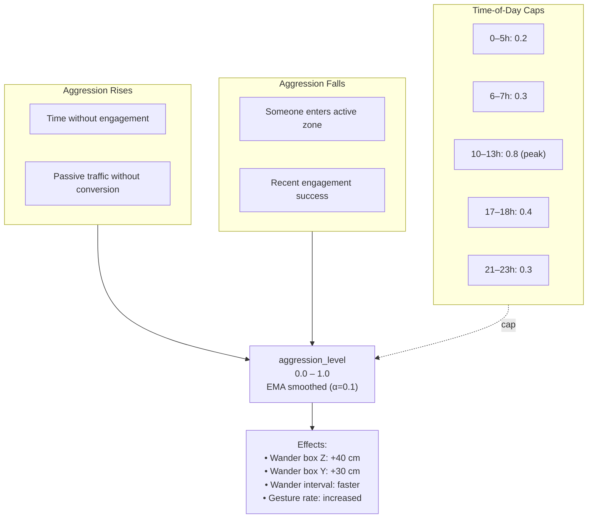

### Key Parameters
| Parameter | Value |
|---|---|
| EMA alpha | 0.1 |
| Range | 0.0 – 1.0 |
| Peak cap (lunch: 10–13h) | 0.8 |
| Low cap (night: 0–5h) | 0.2 |
| Effects at high aggression | +40 cm Z wander, +30 cm Y wander, faster gestures |

---

# 19 — Entry Pulse + People-Count Scaling

Two simple but impactful additions: a **brightness flash** when someone enters the active zone, and **per-person brightness scaling** in ENGAGED and CROWD modes.

### Entry Pulse
| Parameter | Value |
|---|---|
| Brightness boost | +25 DMX (one-shot) |
| Duration | 0.8 s |
| Trigger | Person crosses from passive → active zone |

### People-Count Scaling
| Parameter | Value |
|---|---|
| Brightness increase | +20% per person in active zone |
| Applies to | `brightness_min` and `brightness_max` |

---

# 20 — Anti-Repetition (Memory)

The `memory` personality slider scales an **anti-repetition system** that tracks recent gestures and positions, suppressing patterns that have been used recently. This prevents the light from falling into visible loops.

### Key Parameters
| Parameter | Value |
|---|---|
| Memory slider range | 0.0 – 1.0 |
| Effect at 1.0 | Full suppression of recently used gestures |
| Effect at 0.0 | No suppression (may repeat) |
| Tracking | Recent gesture types + recent position history |

---

# 21 — Almost-Engaged Attraction

Detects people who **slow down in the passive zone** near the active zone boundary — prime targets for attraction. Three strategies are A/B tested to learn which works best.

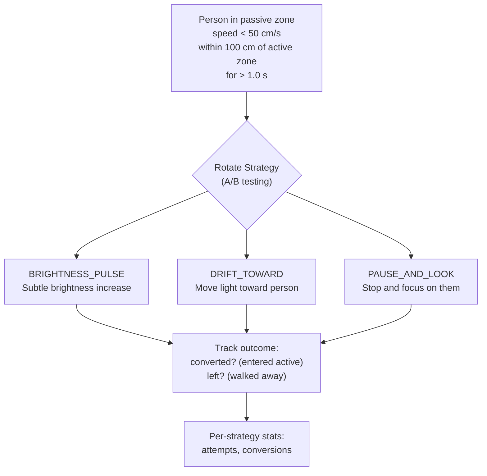

### Key Parameters
| Parameter | Value |
|---|---|
| Slow speed threshold | < 50 cm/s |
| Near active threshold | Within 100 cm |
| Min detection time | 1.0 s |
| Attraction cooldown | 5.0 s between attempts |
| Drift X offset | ±50 cm toward candidate |

---

# 22 — Feedback Learning

A slow learning system that logs **what the light was doing when people engaged** and gradually weights successful behaviors higher. Creates emergent learning: "What was I doing when people engaged? Do more of that."

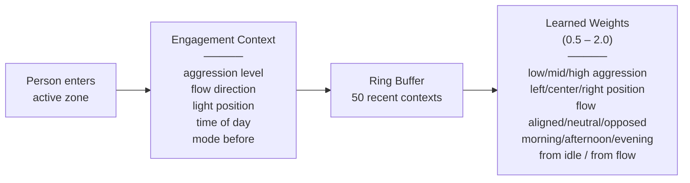

### Key Parameters
| Parameter | Value |
|---|---|
| Buffer size | 50 engagement contexts |
| Learning rate | ±0.02 per engagement |
| Weight range | 0.5 – 2.0 |
| Dimensions | aggression × position × flow × time × mode |
| Effect | Weights multiply corresponding behavior parameters |

---

# 23 — AutoTuning Feedback Loop

The `AutoTuningManager` runs every 5 seconds and **continuously adjusts all 12 personality/global parameters** based on observed activity. This creates a light that learns and adapts its character over hours.

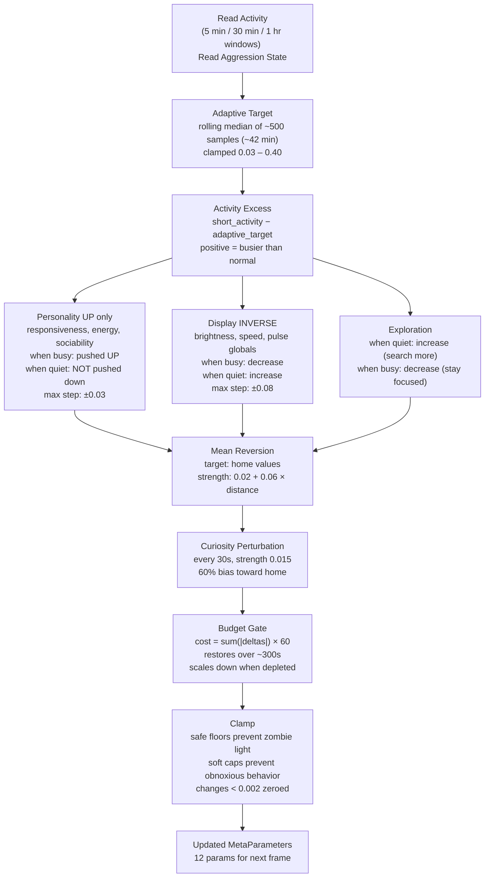

### AutoTuning Constraints
| Parameter | Safe Floor | Soft Cap | Home Value |
|---|---|---|---|
| responsiveness | 0.30 | 0.90 | 0.50 |
| energy | 0.25 | 0.85 | 0.45 |
| attention_span | 0.10 | — | 0.50 |
| sociability | 0.20 | — | 0.45 |
| exploration | 0.15 | — | 0.40 |
| memory | — | — | 0.30 |
| brightness_global | 0.60 | 3.0 | 1.20 |
| speed_global | 0.35 | 1.6 | 0.70 |
| pulse_global | 0.35 | 2.0 | 0.80 |
| follow_speed_global | 0.60 | — | 1.00 |
| dwell_influence | — | — | 0.50 |
| idle_trend_weight | 0.10 | — | 0.40 |

### Key Design Choice: Asymmetric Adjustment
Personality sliders are only pushed **up** when activity is high — never pushed down. Only mean reversion gently brings them back toward home values. This prevents the light from becoming permanently suppressed on a quiet sidewalk.

---

# 24 — Daily Learning + Reset Cycles

The system persists what it learns across days. At midnight, the current parameter state is snapshotted and blended into "learned home values" for the next startup. Four daily resets prevent long-term drift.

```mermaid
flowchart LR
    subgraph DAILY["End of Day (midnight)"]
        SNAP["Snapshot: 60% final value\n+ 40% midpoint of range"]
        DB["Store per time-of-day\nperiod in database"]
    end

    subgraph STARTUP["Next Startup"]
        LOAD["Load learned values\nBlend: 30% toward learned"]
    end

    subgraph RESETS["Periodic Resets"]
        R1["Midnight: 40% blend toward home"]
        R2["6 AM: 40% blend toward home"]
        R3["Noon: 40% blend toward home"]
        R4["6 PM: 40% blend toward home"]
    end

    subgraph WEEKLY["7-Day History"]
        W["Weighted average\nof per-period engagement"]
        CAP["Cap loosening:\nif param hits ceiling consistently,\nnudge cap up 10% next day"]
    end

    SNAP --> DB --> LOAD
    DB --> W --> LOAD
    W --> CAP
```

### Key Parameters
| Parameter | Value |
|---|---|
| Daily snapshot blend | 60% final + 40% midpoint |
| Startup blend | 30% toward learned values |
| Reset hours | {0, 6, 12, 18} |
| Reset strength | 40% toward home |
| Weekly history | 7-day weighted average |
| Cap loosening | 10% per day if consistently hit |

---

# 25 — WebSocket Public Viewer

Real-time state is broadcast over WebSocket to a **Three.js web viewer** that renders the light, panels, tracked people, wander box, and track zones in 3D. Accessible remotely via Tailscale Funnel.

```mermaid
flowchart LR
    CONTROLLER["Light Controller\nstate snapshot"] --> WS["WebSocket Server\nport 8765\n~15 FPS"]
    WS --> VIEWER["Three.js Viewer\n• Light sphere\n• 12 panels with brightness\n• Tracked people\n• Wander box wireframe\n• Track zone boundaries\n• Mobile-first web app"]
```

### Key Parameters
| Parameter | Value |
|---|---|
| WebSocket port | 8765 |
| Broadcast rate | ~15 FPS |
| Payload | JSON: light pos, brightness, panel DMX, people, mode |
| Auto-reconnect | 3 s |
| Viewer engine | Three.js + OrbitControls |
| Hosting | GitHub Pages |

---

# 26 — Production 24/7 Hardening

The final layer adds operational stability for continuous unattended operation: health monitoring, database pruning, single-instance locking, and persistent settings.

### Key Parameters
| Parameter | Value |
|---|---|
| Health log interval | Every 5 minutes |
| Database pruning | Every hour |
| Raw event retention | 48 hours (aggregated before deletion) |
| Single instance lock | `fcntl` file lock at `/tmp/lightController.lock` |
| Settings auto-save | Every 5 seconds |
| YOLO model reload | Every hour (prevent tracker drift) |
| Slider settings file | `slider_settings.json` |
| Override file | `autotune_overrides.json` (hot-reload every 30 s) |

---

# Summary: The Full 17-Layer Parameter Pipeline

Every frame, `calculate_parameters()` in `light_behavior.py` passes the output through **17 sequential layers** — the accumulated result of every step above:

```mermaid
flowchart TB
    subgraph F["Foundation"]
        L1["1. Mode Base Values\n(Step 6)"]
        L2["2. Transition Interpolation\n(Step 7)"]
        L3["3. People-Count Scaling\n(Step 19)"]
    end

    subgraph P["Personality + Context"]
        L4["4. MetaParameter Modifiers\n(Step 10)"]
        L5["5. Time-of-Day\n(Step 11)"]
        L6["6. Dwell Rewards\n(Step 12)"]
        L7["7. Anti-Repetition\n(Step 20)"]
    end

    subgraph E["Environmental Response"]
        L8["8. Idle Trends\n(Step 16)"]
        L9["9. Aggression\n(Step 18)"]
        L10["10. Flow Positioning\n(Step 17)"]
        L11["11. Almost-Engaged Attraction\n(Step 21)"]
        L12["12. Feedback Learning\n(Step 22)"]
        L13["13. Proximity Response\n(Step 15)"]
    end

    subgraph O["Momentary Overlays"]
        L14["14. Flow Bias"]
        L15["15. Entry Pulse\n(Step 19)"]
        L16["16. Breathing Overlay\n(Step 13)"]
        L17["17. Settle / Bloom\n(Step 9)"]
    end

    L1 --> L2 --> L3 --> L4 --> L5 --> L6 --> L7 --> L8 --> L9 --> L10 --> L11 --> L12 --> L13 --> L14 --> L15 --> L16 --> L17

    L17 --> OUT["Final behavior_params\n+ wander_box\n─────\nbrightness_min / brightness_max\npulse_speed / falloff_radius\nmove_speed / follow_smoothing\nwander_interval\nwander_box (x, y, z bounds)"]
```

---

# Complete Parameter Index

Every parameter in the system, in the order they were introduced:

| Step | Parameter | Range / Unit | Purpose |
|---|---|---|---|
| 1 | DMX channel values | 0 – 255 | Raw panel brightness |
| 2 | Light X, Y, Z | cm | Virtual light position |
| 2 | Falloff Radius | 20 – 200 cm | Distance-based panel illumination range |
| 3 | Move Speed | 5 – 100 cm/s | Light movement rate |
| 3 | Brightness Min / Max | 0 – 255 | Pulse range |
| 3 | Pulse Rate | 500 – 8000 ms | Breathing sine wave period |
| 3 | Move Area | cm³ | Position boundary |
| 5 | Active / Passive zone | Z thresholds | Person classification |
| 6 | Mode (IDLE/ENGAGED/CROWD/FLOW) | enum | Behavioral state |
| 7 | Stickiness timers | 0 – 15 s | Delay before mode switch |
| 7 | Transition durations | 0.5 – 4.0 s | Param interpolation time |
| 7 | Min mode duration | 8 s | Anti-flicker guard |
| 8 | Wander Box (x, y, z min/max) | cm | Light movement boundary |
| 8 | Wander Interval | 0 – 5 s | Target pick frequency |
| 8 | Animation lerp speed | 3.0 | Box convergence rate |
| 9 | Gesture types | 10 (later 16) | Expressive animation set |
| 9 | Bloom cooldown | 45 s | Min time between blooms |
| 10 | Personality sliders | 0.0 – 1.0 × 6 | Light character |
| 10 | Global multipliers | 0.2 – 5.0 × 6 | Output scaling |
| 11 | Time-of-day multipliers | per period | Brightness, pulse, wander Y |
| 12 | Dwell phases | 4 thresholds | Engagement depth |
| 12 | Dwell influence | 0.0 – 2.0 | Bonus scaling |
| 13 | Breathing depth | 0 – 1.0 | Overlay intensity |
| 13 | Breathing period | 6.0 s | Breath cycle |
| 13 | Engaged gesture amplitudes | 8 – 18 cm | Per-gesture motion |
| 14 | YOLO confidence | 0.10 – 0.80 | Detection threshold |
| 14 | Fusion distance | 50 – 300 cm | Cross-camera merge |
| 14 | EMA alpha | 0.01 – 0.20 | Track smoothing |
| 15 | Proximity Z near / far | 100 / 280 cm | Speed/bright/smooth scaling |
| 16 | Trend windows | 1m / 5m / 30m / 1h | Activity memory |
| 17 | Flow direction | −1 to +1 | Crowd movement vector |
| 17 | Flow X offset | ±60 cm | Wander box shift |
| 18 | Aggression level | 0.0 – 1.0 | Attention-seeking intensity |
| 18 | Time-of-day aggression caps | 0.2 – 0.8 | Max aggression by hour |
| 19 | Entry pulse boost | +25 DMX, 0.8 s | Welcome flash |
| 21 | Attraction strategies | 3 types | A/B tested conversion |
| 22 | Feedback weights | 0.5 – 2.0 | Learned behavior multipliers |
| 22 | Learning rate | 0.02 | Weight change per event |
| 23 | AutoTune cycle | 5 s | Adjustment frequency |
| 23 | Max step (personality) | ±0.03 | Per-cycle change limit |
| 23 | Max step (global) | ±0.08 | Per-cycle change limit |
| 23 | Safe floors | per param | Minimum viable values |
| 23 | Soft caps | per param | Maximum sane values |
| 23 | Home values | per param | Mean-reversion targets |
| 23 | Curiosity interval | 30 s | Random exploration |
| 23 | Budget cost scale | 60.0 | Change rate limiter |
| 24 | Daily snapshot blend | 60/40 | Learning persistence |
| 24 | Startup blend | 30% | Learned value incorporation |
| 24 | Reset hours | {0, 6, 12, 18} | Drift prevention |
| 25 | WebSocket rate | ~15 FPS | Viewer update rate |
| 26 | Health log interval | 300 s | Monitoring frequency |
| 26 | DB prune interval | 3600 s | Cleanup frequency |
| 26 | DB retention | 48 h | Raw event lifespan |

---

*Each step in this document corresponds to a conceptual addition. In practice, many of these were developed together or iterated on across versions (DEV → V1 → V2 → V2.5 → V3 → V4 → production). See [BEHAVIOR_DIAGRAMS.md](BEHAVIOR_DIAGRAMS.md) for the full architectural reference with all feedback loops visible.*
